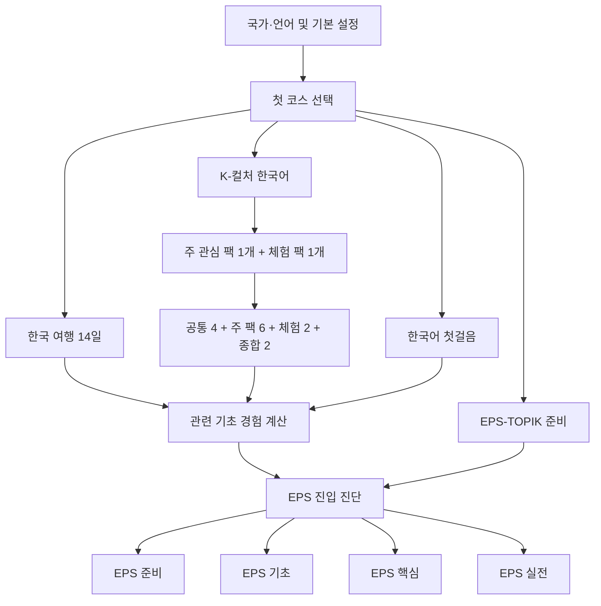

# K-Speak 독립 코스와 EPS 연계 학습 설계

- 작성일: 2026-08-08
- 상태: 1차 독립 검토 반영안, 구현 계획 작성 전 기준
- 검토 반영일: 2026-08-08
- 대상 저장소: `korean-first-talk` / K-Speak
- 구현 범위: 한국 여행, K-컬처 한국어, EPS-TOPIK 준비
- 기존 과정: 한국어 첫걸음은 유지하며 이번 범위에서 콘텐츠를 확장하지 않는다.
- 후속 범위: 한국 생활·직장 실전은 이번 설계와 구현에서 제외한다.

## 1. 결정 요약

K-Speak는 하나의 긴 선형 코스를 목표별로 조금씩 바꾸는 구조에서, 사용자가 목적에 맞는 코스를 독립적으로 선택하는 구조로 확장한다.

최상위 코스는 다음 네 개다.

1. `foundation`: 기존 한국어 첫걸음
2. `travel`: 한국 여행 14일
3. `k-culture`: K-컬처 한국어 14일 시작 경로
4. `eps-topik`: EPS-TOPIK 준비 4단계, 30회 핵심 준비 경로

이번 신규 개발은 `travel`, `k-culture`, `eps-topik` 세 코스에만 적용한다. 기존 첫걸음 코드는 새 구조에 연결하고 기존 진도를 보존하는 데 필요한 최소 변경만 허용한다.

코스별 진도와 완료 결과는 독립적으로 저장한다. 로그인, 튜터, 저장 문장, 복습 엔진, 오디오 재생, 국가팩, 오프라인 지원은 공통 기반을 재사용한다.

여행과 K-컬처에서 익힌 숫자, 시간, 안내문, 지시 표현 같은 기초 능력은 EPS 준비에 활용한다. 그러나 다른 코스를 완료했다는 이유만으로 EPS 수업을 자동 통과시키지 않는다. EPS 진입 진단이나 EPS 전용 확인 문제를 통과했을 때만 시작 단계를 단축한다.

최종 제품 범위는 유지하되 한 번에 출시하지 않는다. 공통 기반, 여행, K-컬처, EPS 준비·기초, EPS 핵심·실전을 독립 출시 게이트로 나누고 각 게이트가 자체 테스트와 콘텐츠 승인을 통과한 뒤 다음 범위를 연다.

## 2. 제품 목표

### 2.1 사용자 목표

- 여행 예정자는 일반 한국어 과정을 먼저 끝내지 않고 바로 여행 회화를 시작한다.
- K-컬처 관심자는 좋아하는 분야를 통해 실제로 듣고 말할 수 있는 한국어를 배운다.
- EPS 준비자는 현재 수준에 맞는 단계에서 시작하고 시험형 읽기·듣기까지 이어간다.
- 한 코스에서 배운 기초 표현이 다른 코스에서 다시 도움이 된다는 연결감을 느낀다.
- 코스를 바꿔도 기존 진도, 저장 문장, 복습 기록이 사라지지 않는다.

### 2.2 제품 목표

- K-Speak의 핵심 약속인 상황 중심, 짧은 말하기, 기준 음성과 내 목소리 비교를 유지한다.
- 문화 콘텐츠를 단순 감상이나 단어 암기가 아니라 실제 대화 행동으로 전환한다.
- EPS를 별도 시험 모드로 제공하면서도 여행과 문화 학습이 EPS 기초 준비로 이어지게 한다.
- 국가별 번역과 설명은 동일한 한국어 학습 목표를 공유하되, 설명 방식과 발음 안내를 현지화한다.
- 저작권이 있는 가사, 드라마 대사, 웹툰 장면, 연예인 이미지 없이 자체 콘텐츠로 운영한다.

### 2.3 비목표

- EPS-TOPIK 합격을 보장하거나 합격 확률을 계산하지 않는다.
- 실제 시험의 비공개 문항을 복제하거나 유사 문항이라고 홍보하지 않는다.
- 무제한 AI 채팅, 실시간 교사 연결, 영상 스트리밍 수업을 추가하지 않는다.
- K-pop, K-drama, K-food, K-beauty, K-webtoon을 각각 최상위 모드로 분리하지 않는다.
- 한국 생활·직장 실전 과정을 이번 범위에 포함하지 않는다.
- 실제 인물의 목소리, 얼굴, 화법을 복제하지 않는다.

## 3. 설계 원칙

1. **사용자에게는 독립 코스, 내부에는 공통 기반**
   코스 선택과 진도는 분리하되 학습 엔진, 복습, 저장, 오디오는 공유한다.

2. **상황 먼저, 설명은 나중**
   모든 일반 수업은 장면 진입, 전체 대화, 핵심 표현, 바꿔 말하기, 녹음 비교, 한 턴 역할극 순서를 유지한다.

3. **완료와 능력을 구분**
   코스 완료는 학습 경로를 끝냈다는 뜻이다. EPS 준비도나 실제 능력은 진단과 객관식 확인 결과로 따로 표시한다.

4. **노출과 검증을 구분**
   여행이나 K-컬처에서 관련 표현을 배운 것은 `관련 경험`이다. EPS 진단을 통과한 상태만 `확인됨`으로 처리한다.

5. **억지 연동 금지**
   K-pop 수업에 산업 안전 표현을 삽입하는 식으로 주제를 훼손하지 않는다. 자연스럽게 공유되는 기초 능력만 연결한다.

6. **기존 진도 보존**
   기존 `day-*` 수업 ID를 변경하지 않는다. 새 코스만 이름공간이 있는 ID를 사용한다.

7. **저용량 우선**
   정적 이미지와 검수된 정적 음원을 우선하며, 영상 자동 재생을 전제로 하지 않는다.

## 4. 전체 사용자 흐름



### 4.1 신규 사용자

1. 국가팩과 한국어 경험을 선택한다.
2. 첫 코스를 `첫걸음`, `여행`, `K-컬처`, `EPS-TOPIK` 중에서 선택한다.
3. 여행은 바로 Day 1로 진입한다.
4. K-컬처는 주 관심 분야 하나와 체험 분야 하나를 선택한 뒤 첫 14일 경로를 생성한다.
5. EPS는 학습 경험 선택 후 준비 단계 또는 진입 진단으로 이동한다.

### 4.2 기존 사용자

- 현재 기존 첫걸음 진도와 홈을 그대로 유지한다.
- 기존 `learningGoal`에 따라 여행 또는 K-컬처 코스를 추천할 수 있지만 자동으로 활성 코스를 바꾸지 않는다.
- 코스 선택 화면에서 새 코스를 시작할 수 있다.
- 기존 `day-*` 진도, 복습, 저장 문장은 모두 `foundation` 소속으로 해석한다.

### 4.3 코스 전환

- 홈 상단의 현재 코스 버튼을 누르면 코스 선택 시트가 열린다.
- 각 코스에는 `시작 전`, `진행 중`, `완료` 상태와 다음 학습 위치가 표시된다.
- 코스를 바꿔도 진행 중 수업과 복습 일정은 유지된다.
- 하단 내비게이션 항목은 늘리지 않는다.

## 5. 코스 구조

## 5.1 한국 여행 14일

### 약속

한국 방문 중 자주 마주치는 장면에서 첫 문장을 말하고, 상대의 짧은 응답을 이해하고, 문제가 생겼을 때 도움을 요청할 수 있게 한다.

### 선행 조건

- 없음
- 한글을 읽지 못하는 사용자는 로마자와 느린 음성을 켤 수 있다.
- 한글 미니 드릴은 필요할 때 열 수 있지만 여행 진입을 막지 않는다.

### 14일 구성

| Day | 장면 | 핵심 행동 | EPS와 자연스럽게 겹치는 기초 |
|---|---|---|---|
| 1 | 공항 도착 | 인사하고 한국어가 서툴다고 알리기 | 기본 인사, 정중한 종결 |
| 2 | 입국·수하물 | 장소와 줄을 확인하기 | 표지, 위치, 질문 |
| 3 | 교통카드·SIM | 필요한 물건과 수량 요청하기 | 숫자, 단위, 구매 |
| 4 | 지하철·버스 | 노선, 출구, 목적지 확인하기 | 방향, 번호, 교통 정보 |
| 5 | 길 찾기 | 위치를 묻고 짧은 안내 확인하기 | 위치어, 이동 지시 |
| 6 | 숙소 체크인 | 예약과 이름 확인하기 | 이름, 날짜, 실용 정보 |
| 7 | 객실 문제 | 고장이나 부족한 물건 알리기 | 문제 보고, 요청 표현 |
| 8 | 식당 주문 | 메뉴와 수량 주문하기 | 수량, 음식 어휘, 요청 |
| 9 | 알레르기·맵기 | 먹지 못하는 재료와 강도 말하기 | 금지, 주의, 조건 |
| 10 | 카페·포장 | 매장 이용과 포장 요청하기 | 선택, 주문, 후속 질문 |
| 11 | 쇼핑 | 크기, 색상, 가격 묻기 | 비교, 상품 정보, 숫자 |
| 12 | 결제·환불 | 결제 방법과 영수증 확인하기 | 가격, 실용 자료, 확인 |
| 13 | 도움 요청 | 현재 상태를 한 문장으로 설명하고 도움 요청하기 | 상태 설명, 요청 표현 |
| 14 | 종합 여행 미션 | 첫 문장, 응답 이해, 구출 표현으로 상황 마무리하기 | 안내문, 듣기, 상황 판단 |

### 완료 조건

- 14개 수업 완료
- Day 14 종합 역할극 시도
- Day 14 결과에서 `첫 문장 선택·말하기`, `짧은 응답 이해`, `막혔을 때 구출 표현 선택`을 각각 확인한다.
- 위 세 행동의 결과는 완료 여부와 분리해 `해냈어요` 또는 `더 연습해요`로 보여주며 정확도 백분율을 만들지 않는다.
- 녹음이나 음성 인식 성공 여부는 완료 조건이 아니다.

## 5.2 K-컬처 한국어 14일 시작 경로

### 약속

좋아하는 한국 문화 장면에서 자주 듣고 읽는 표현을 이해하고, 그 표현을 실제 일상 대화의 자연스러운 존댓말로 바꿔 말할 수 있게 한다.

### 구성 방식

K-컬처는 하나의 최상위 코스 안에 다섯 관심 팩을 둔다.

- `k-pop`
- `k-drama`
- `k-food` - 음식과 디저트 포함
- `k-beauty`
- `k-webtoon`

사용자는 시작할 때 깊게 배울 `주 관심 팩` 하나와 가볍게 경험할 `체험 팩` 하나를 선택한다. 두 팩은 서로 달라야 한다. 첫 14일 경로는 다음 14개 슬롯으로 구성한다.

- 공통 수업 4개
- 주 관심 팩 수업 6개
- 체험 팩 수업 2개
- 종합 수업 2개

### 경로 순서

| 슬롯 | 수업 |
|---|---|
| 1 | 공통: 존댓말과 반말의 거리감 |
| 2 | 주 관심 팩-1 |
| 3 | 공통: 짧은 반응과 감정 표현 |
| 4 | 주 관심 팩-2 |
| 5 | 체험 팩-1 |
| 6 | 주 관심 팩-3 |
| 7 | 공통: 숫자, 시간, 일정, 공지 |
| 8 | 주 관심 팩-4 |
| 9 | 체험 팩-2 |
| 10 | 공통: 콘텐츠 표현을 실제 말투로 바꾸기 |
| 11 | 주 관심 팩-5 |
| 12 | 주 관심 팩-6 |
| 13 | 종합: 같은 표현, 다른 상황 |
| 14 | 종합: 주 관심 분야 중심 혼합 역할극 |

### 관심 팩별 수업

| 팩 | 1 | 2 | 3 | 4 | 5 | 6 |
|---|---|---|---|---|---|---|
| K-pop | 일정·티켓 | 공연장 공지 | 응원과 팬 대화 | 굿즈·수량 | 댓글 표현을 실제 말로 바꾸기 | 공연 감상과 추천 |
| K-drama | 첫 만남과 관계 | 부탁·거절 | 사과·위로 | 오해와 확인 | 극적인 대사를 일상 표현으로 바꾸기 | 장면 감상과 의견 |
| K-food | 메뉴·주문 | 재료·수량 | 맛과 식감 | 조리 순서 | 알레르기·위생 | 음식과 디저트 추천 |
| K-beauty | 제품·색상 | 피부 고민·요청 | 기능과 비교 | 사용 순서·라벨 | 주의사항·교환 | 사용 후기와 추천 |
| K-webtoon | 장면 순서 | 감정·말투 | 인물 관계 | 문맥과 다음 대사 | 과장된 대사를 실제 존댓말로 바꾸기 | 줄거리와 감상 |

### 관심 분야 변경 규칙

- 첫 팩 전용 수업을 시작하기 전에는 주 관심 팩과 체험 팩을 자유롭게 변경한다.
- 첫 팩 전용 수업을 시작한 뒤에는 첫 14일 경로를 고정한다. 진행 중 경로를 다시 계산하지 않는다.
- 생성된 `routeSlots`를 등록 정보에 저장해 여러 기기에서 같은 슬롯과 수업을 재현한다.
- 첫 14일 경로를 완료한 뒤에는 다른 팩의 선택 수업을 후속 모듈에서 열 수 있다. 후속 모듈은 최초 `routeSlots`와 완료 기록을 수정하지 않는다.
- 사용자 화면에는 `K-컬처 완료`가 아니라 `첫 14일 경로 완료`라고 표시한다.

### 저작권 원칙

- 실제 노래 가사, 드라마 대사, 웹툰 컷, 연예인 이름·얼굴·목소리를 사용하지 않는다.
- 자체 캐릭터, 자체 대사, 자체 이미지와 정식 사용이 승인된 에셋만 사용한다.
- 브랜드 제품명 대신 일반 품목명을 사용한다.
- 향후 정식 제휴 콘텐츠는 별도의 라이선스 플래그와 콘텐츠 소스로 격리한다.
- K-컬처 진입 화면에 `실제 작품이 아닌 K-Speak 자체 제작 학습 장면입니다`를 표시한다.

## 5.3 EPS-TOPIK 준비 4단계, 30회 핵심 준비 경로

### 약속

EPS-TOPIK의 읽기·듣기 형식에 익숙해지고, 일상 한국어, 실용 정보, 산업 안전과 작업 관련 한국어를 단계적으로 준비한다. 30회 학습은 시험 준비를 끝낸다는 뜻이 아니라 반복 모의시험과 취약 영역 복습으로 들어가기 위한 핵심 경로다.

### 표시 원칙

- `합격 가능성 82%` 같은 표현을 사용하지 않는다.
- 단계 완료와 시험 준비 상태를 분리한다.
- 준비 상태는 `확인 전`, `기초 형성 중`, `실전 연습 가능` 같은 영역별 상태로 표시한다.
- 공식 기관이 제공하거나 인증한 앱처럼 보이게 하지 않는다.
- EPS 진입·결과 화면에 `비공식 학습 과정`을 표시하고 공식 시험 안내 링크, `standardCheckedAt`, `assessmentVersion`을 함께 제공한다. `standardCheckedAt`은 EPS 콘텐츠를 승인할 때 실제 확인일로 갱신한다.

### 진입 선택

1. `한국어를 처음 배워요` - EPS 준비 1회부터 시작
2. `다른 K-Speak 과정을 배웠어요` - 16문항 짧은 진입 진단
3. `이미 EPS-TOPIK을 공부했어요` - 16문항 진입 진단 후 단계별 확인 세트 선택

16문항 진입 진단은 `EPS 준비` 또는 `EPS 기초`의 권장 시작점만 제시한다. `EPS 핵심`과 `EPS 실전` 진입 권장은 각 단계 전용 확인 세트를 통과했을 때만 제공한다. 사용자는 더 쉬운 단계나 아직 확인되지 않은 어려운 단계를 직접 선택할 수 있지만, 이 선택은 능력 확인이나 이전 단계 완료로 기록하지 않는다.

### 단계 구성

| 단계 | 권장 회차 | 핵심 영역 | 다른 코스 연동 |
|---|---|---|---|
| EPS 준비 | 1~6 | 소리·표기, 받침·연음 기초, 숫자·단위, 시간·날짜, 기본 문장 | 첫걸음에서 가장 많이 연결 |
| EPS 기초 | 7~14 | 일상 어휘·어법, 장소·이동, 구매, 일정·양식, 실용 자료 | 첫걸음·여행 일부 연결 |
| EPS 핵심 | 15~26 | 작업 지시, 산업 안전, 표지, 공정 순서, 문제 보고, 그림·대화·지문 이해 | EPS 전용 검증 필수 |
| EPS 실전 | 27~30 | 제한 시간 읽기, 제한 시간 듣기, 혼합 약점 훈련, 40문항 모의시험 | 다른 코스로 대체 불가 |

### 30회 세부 범위

- 1~2회: 한글 소리와 표기, 받침·연음 듣기
- 3~4회: 한자어·고유어 숫자, 단위, 가격, 수량
- 5~6회: 시간·날짜·요일, 기본 인사와 정중한 문장
- 7~8회: 장소·이동·생활 동사
- 9~10회: 구매·수량·비교·금지
- 11~12회: 일정표·신청서·영수증·간단한 표
- 13~14회: 기초 어휘·어법과 단계 확인
- 15~16회: 안전 표지와 보호 장비
- 17~18회: 작업 지시와 기계 사용 순서
- 19~20회: 공정 순서, 수량, 위치, 상태
- 21~22회: 문제 보고, 고장, 건강, 긴급 상황
- 23~24회: 그림 설명과 알맞은 문장 선택
- 25~26회: 대화의 다음 반응, 이야기의 중심·세부 내용
- 27회: 읽기 실전 세트
- 28회: 듣기 실전 세트
- 29회: 영역별 취약 항목 재연습
- 30회: 읽기 20문항 + 듣기 20문항의 50분 모의시험

30회 핵심 경로가 끝나면 `모의시험 → 영역별 결과 → 취약 영역 복습 → 새 모의시험` 반복 경로를 제공한다. 화면에는 `EPS 과정 완료`가 아니라 `30회 핵심 경로 완료`라고 표시한다.

### 진단·모의시험 시도 규칙

- 문항과 음원은 자체 제작하고 공식 공개문제는 형식 연구에만 사용한다.
- 시작할 때 고유한 `attemptId`, 고정된 `questionOrder`, `assessmentVersion`, `startedAt`을 만든다.
- 답변할 때마다 `answers`, `currentIndex`, `lastSavedAt`을 저장한다. 화면 이탈과 앱 백그라운드 전환 전에도 저장을 시도한다.
- 연습 세트와 진단은 마지막 저장 문항부터 이어서 할 수 있다.
- 50분 모의시험은 벽시계 기준 `expiresAt`을 저장하며 앱을 벗어나도 시간이 계속 흐른다.
- 남은 시간 안에는 같은 시도로 재진입할 수 있다. 시간이 끝나면 상태를 `expired`로 바꾸고 미응답은 미응답으로 처리한다.
- 음원 오류 문항 ID는 `unavailableQuestionIds`에 기록하고 진단·점수의 분모에서 제외하며, 필요한 필수 음원이 없으면 시작 자체를 막는다.
- 완료된 시도의 답변과 문항 순서는 수정하지 않는다. 재응시는 새 `attemptId`를 만든다.
- 최종 결과는 종료된 시도의 `attemptId`와 `assessmentVersion`에 연결해 멱등하게 한 번 생성한다. 같은 시도를 다시 불러와 중복 결과를 만들지 않는다.
- 정적 검수 음원이 없는 듣기 모의시험은 `준비 중`으로 표시하고 점수를 만들지 않는다.
- 브라우저 TTS는 일반 학습의 대체 재생에는 사용할 수 있지만 시험형 듣기 결과 산정에는 사용하지 않는다.

## 6. 자연스러운 EPS 연계 레이어

## 6.1 목적

여행과 K-컬처의 재미를 해치지 않으면서 EPS 준비에 필요한 기초 능력을 반복 노출한다. 전체 능력 그래프를 처음부터 구축하지 않고, EPS 기초에 직접 관련된 제한된 태그만 사용한다.

## 6.2 기초 능력 태그

| 영역 | 태그 예시 |
|---|---|
| 소리 | `sound-symbol`, `batchim`, `liaison` |
| 숫자 | `sino-number`, `native-number`, `time-date`, `price-quantity` |
| 기능 | `location-direction`, `request`, `prohibition`, `sequence`, `comparison`, `condition` |
| 문해 | `sign`, `schedule-table`, `label-instruction`, `dialogue-inference` |
| 듣기 | `number-listening`, `next-response`, `situation-match`, `gist-detail` |
| 말투·문화 | `polite-ending`, `relationship-register`, `public-announcement` |

각 일반 수업은 0~3개의 `bridgeSkillIds`를 가진다. 연관성이 약한 수업에는 태그를 억지로 붙이지 않는다.

## 6.3 `같은 표현, 다른 상황` 전이 문제

일부 여행·K-컬처 수업 마지막에 30초 내외의 전이 문제를 넣는다. 전이 문제는 원래 장면의 몰입을 유지하면서 공공 안내, 숫자, 시간, 순서, 금지처럼 중립적으로 공유되는 능력만 다룬다. 산업·직장 맥락은 EPS 코스에 진입한 뒤 처음 제시한다.

1. 현재 관심 장면에서 핵심 표현을 배운다.
2. 같은 문형이나 정보를 가까운 일상·공공 상황에서 듣거나 읽는다.
3. 객관식 또는 한 턴 응답으로 의미를 확인한다.
4. 결과는 일반 수업의 단계 지표에 저장한다.

예시:

- 여행: `3번 출구로 가세요` -> `3번 창구에서 접수하세요`
- K-food: 조리 순서 읽기 -> 포장지의 섭취 순서 확인
- K-beauty: `사용 전에 잘 흔드세요` -> 생활용품의 사용 전 주의 확인
- K-webtoon: 장면 순서 맞추기 -> 짧은 설명문의 사건 순서 파악
- K-drama: 다음 대사 고르기 -> 일상 대화의 후속 반응 선택
- K-pop: 공연 시간표 읽기 -> 공공 일정표에서 시간 정보 찾기

## 6.4 노출 계산과 검증

- `관련 경험`은 완료한 수업과 전이 문제 시도 기록에서 계산한다.
- 별도의 전역 `mastery` 점수를 저장하지 않는다.
- 16문항 진입 진단은 영역별 시작점만 추천하며 `verifiedSkillIds`를 만들지 않는다.
- 단계 확인 세트에서 하나의 능력을 확인하려면 서로 다른 문항이 최소 2개 필요하고 해당 능력 문항의 80% 이상을 맞혀야 한다. 두 문항이면 둘 다 맞혀야 한다.
- 확인 결과는 평가 버전과 함께 저장하며 한 문항의 정답만으로 능력을 확인 처리하지 않는다.
- 여행이나 K-컬처 완료만으로 EPS 준비 또는 핵심 단계를 완료 처리하지 않는다.
- EPS 진단 버전이 바뀌면 이전 결과는 기록으로 남기되 새 결과와 합산하지 않는다.

## 7. 정보 구조와 화면 명세

이번 범위에서 필요한 주요 화면은 여덟 개다.

## 7.1 첫 코스 선택

- 위치: 기존 온보딩의 학습 목표 단계 대체 또는 바로 다음 단계
- 표시: 첫걸음, 여행, K-컬처, EPS-TOPIK
- 각 항목: 이름, 한 줄 결과, 예상 기간, 오프라인 준비 상태
- 국가팩은 정렬과 추천 문구에만 영향을 주며 접근을 차단하지 않는다.
- EPS 수요가 높은 국가팩에서는 EPS를 상단에 추천할 수 있다.
- 정상, 번역 로딩, 데이터 없음, 설정 오류 상태를 제공한다.

## 7.2 코스 선택 시트

- 홈 상단의 현재 코스 버튼에서 연다.
- 네 코스의 상태와 다음 학습 위치를 표시한다.
- 모바일은 하단 시트, 데스크톱은 대화상자를 사용한다.
- 선택 즉시 홈 콘텐츠를 바꾸고 진도는 유지한다.
- 코스 데이터 로딩 실패 시 현재 코스를 유지한다.

## 7.3 활성 코스 홈

- 오늘의 수업과 코스 진도
- 필요한 복습 수
- 저장 문장 수
- 코스별 다음 목표
- 기존 오디오 준비 및 국가별 안내 패널 재사용
- 기존 Day 15~30 후속 패널은 `foundation`이 활성 코스일 때만 기존 위치에 표시하고 다른 코스 홈에서는 표시하지 않는다.

## 7.4 K-컬처 관심 분야 선택

- 주 관심 팩은 단일 선택, 체험 팩은 주 관심 팩을 제외한 단일 선택으로 제공한다.
- 각 팩은 아이콘, 이름, 학습 장면 예시를 표시한다.
- 서로 다른 두 팩이 선택되기 전에는 시작 버튼을 비활성화한다.
- 첫 팩 전용 수업을 시작하면 첫 14일 경로가 고정된다는 설명을 시작 전에 보여준다.
- `실제 작품이 아닌 K-Speak 자체 제작 학습 장면입니다`를 선택 화면에 표시한다.

## 7.5 수업 화면의 전이 단계

- 기존 수업 흐름 뒤, 저장과 요약 전에 배치한다.
- 일반 사용자에게는 `같은 표현, 다른 상황`으로 표시한다.
- 개별 수업에는 산업·직장 맥락이나 EPS 홍보를 삽입하지 않는다.
- 과정 요약에서만 `EPS의 숫자·일정·안내문 기초와 연결된 표현 N개`를 선택적으로 보여주고 EPS 안내로 이동할 수 있게 한다.
- 실패해도 수업 완료를 막지 않고 복습 우선순위만 조정한다.

## 7.6 EPS 진입과 수준 진단

- 진입 경험 세 가지 중 하나를 선택한다.
- 진입 화면에 비공식 과정 표시, 공식 시험 안내 링크, 시험 기준 확인일을 제공한다.
- 진단은 진행 상황을 저장하고 중단 후 이어서 할 수 있다.
- 듣기 음원 오류 시 해당 문항을 실패로 채점하지 않고 재시도 상태로 둔다.
- 결과 화면은 평가 버전, 단계 추천, 영역별 상태, 사용자가 선택한 시작 단계, 시작 버튼을 제공한다.

## 7.7 EPS 준비도와 모의시험

- 소리, 숫자, 어휘·어법, 실용 자료, 듣기, 안전 영역을 표시한다.
- 백분율 합격 예측은 표시하지 않는다.
- 영역별 최근 확인 일자와 권장 복습을 제공한다.
- 듣기 정적 음원이 준비되지 않으면 모의시험 시작을 막고 정확한 이유를 표시한다.

## 7.8 복습 화면

- 기본 필터: 현재 코스
- 추가 필터: 전체, 첫걸음, 여행, K-컬처, EPS
- 현재 코스에 복습이 없고 다른 코스에 복습이 있으면 빈 상태에서 바로 이동할 수 있다.
- EPS에서는 EPS 복습을 우선하고 다른 코스 문장은 `관련 기초 복습`으로 분리한다.

## 8. 데이터 모델

아래 타입은 구현 계약을 설명하기 위한 설계 형태다. 실제 구현에서는 현재 타입과 호환되도록 선택적 필드와 정규화 함수를 먼저 추가한다.

```ts
type CourseId = "foundation" | "travel" | "k-culture" | "eps-topik";

type CulturePackId =
  | "k-pop"
  | "k-drama"
  | "k-food"
  | "k-beauty"
  | "k-webtoon";

type CourseStatus = "not-started" | "in-progress" | "completed";
type EpsStageId = "prep" | "foundation" | "core" | "practice";
type EpsAssessmentKind = "placement" | "stage-check" | "practice-set" | "mock";
type EpsAttemptStatus =
  | "in-progress"
  | "blocked-audio"
  | "completed"
  | "expired";

interface CourseRouteSlot {
  slotId: string;
  lessonId: string;
  assignedAt: string;
}

interface CourseCompletion {
  contentVersion: string;
  routeVersion: string;
  completedAt: string;
}

interface CourseEnrollment {
  courseId: CourseId;
  contentVersion: string;
  routeVersion: string;
  routeSlots?: CourseRouteSlot[];
  primaryCulturePackId?: CulturePackId;
  samplerCulturePackId?: CulturePackId;
  routeLockedAt?: string;
  routeChangedAt?: string;
  selectedStartStageId?: EpsStageId;
  selectedStartStageChangedAt?: string;
  placementResults?: EpsPlacementResult[];
  stageVerifications?: EpsStageVerification[];
  startedAt?: string;
  completions: CourseCompletion[];
  updatedAt: string;
}

interface EpsPlacementResult {
  attemptId: string;
  assessmentVersion: string;
  recommendedStageId: "prep" | "foundation";
  domainStates: Record<string, "not-checked" | "building">;
  assessedAt: string;
}

interface EpsStageVerification {
  attemptId: string;
  assessmentVersion: string;
  stageId: Exclude<EpsStageId, "practice">;
  domainStates: Record<string, "not-checked" | "building" | "practice-ready">;
  verifiedSkillIds: string[];
  assessedAt: string;
}

interface EpsAttemptAnswer {
  value: string | string[] | null;
  answeredAt: string;
}

interface EpsAssessmentAttempt {
  attemptId: string;
  kind: EpsAssessmentKind;
  assessmentId: string;
  assessmentVersion: string;
  questionOrder: string[];
  answers: Record<string, EpsAttemptAnswer>;
  currentIndex: number;
  status: EpsAttemptStatus;
  startedAt: string;
  expiresAt?: string;
  lastSavedAt: string;
  unavailableQuestionIds: string[];
}
```

### 8.1 `UserState` 확장

- `activeCourseId?: CourseId`
- `activeCourseChangedAt?: string`
- `courseEnrollments?: Partial<Record<CourseId, CourseEnrollment>>`
- `epsAssessmentAttempts?: Record<string, EpsAssessmentAttempt>`

`activeCourseId`와 `activeCourseChangedAt`은 하나의 논리적 값이다. 둘 중 하나만 따로 병합하거나 저장하지 않는다. 기존 필드는 제거하지 않으며 누락된 새 필드는 로드 시 기본값으로 정규화한다.

`CourseStatus`는 동기화 필드로 저장하지 않고 다음 규칙으로 계산한다.

- `startedAt`이 없으면 `not-started`
- 현재 `routeVersion`과 일치하는 완료 기록이 있으면 `completed`
- 그 외에는 `in-progress`
- 이전 `routeVersion`의 완료 기록은 삭제하지 않고 이력으로 보존한다.
- 학습 목표가 변하지 않는 편집은 `contentVersion`만 올리고 `routeVersion`은 유지한다. 필수 학습 목표가 달라질 때만 새 `routeVersion`을 만든다.

정적 경로인 첫걸음·여행·EPS는 `routeVersion`에 해당하는 수업 목록을 코스 레지스트리에서 읽는다. 사용자별 경로가 필요한 K-컬처만 안정적인 `slotId`를 가진 `routeSlots`를 저장한다. `updatedAt`은 감사와 outbox 정리에만 사용하며 필드 전체의 충돌 판정 기준으로 사용하지 않는다.

### 8.2 `Lesson` 확장

레거시 입력을 읽는 경계 타입에서는 `courseId?: CourseId`를 허용한다. 정규화가 끝난 런타임 `Lesson`에서는 `courseId: CourseId`가 필수다.

- `moduleId?: string`
- `contentVersion: string`
- `bridgeSkillIds?: string[]`
- `transferChallenge?: LessonTransferChallenge`

기존 수업은 로드 경계에서 `courseId`가 없으면 `foundation`으로 보충한다. 엔진과 저장 계층은 선택적 `courseId`를 받지 않는다.

### 8.3 복습과 저장 문장

레거시 저장 입력 타입만 선택적 `courseId`를 허용한다. 정규화된 `ReviewItem`과 `SavedPhrase`의 `courseId`는 필수다.

- 새 데이터는 생성 시점에 명시적 `courseId`를 기록한다.
- 기존 데이터는 로드 경계에서 `lessonId`를 통해 `foundation`으로 보충한다.
- 정규화 이후 누락된 `courseId`는 조용히 `foundation`으로 저장하지 않고 개발·검증 오류로 처리한다.
- 복습 ID와 저장 문장 ID에는 코스 이름공간을 포함해 충돌을 막는다.

### 8.4 수업 ID 규칙

- 기존 첫걸음: 현재 `day-*` ID 유지
- 여행: `travel-day-01`
- K-컬처 공통: `kculture-core-01`
- K-컬처 팩: `kculture-food-01`, `kculture-drama-01` 등
- K-컬처 종합: `kculture-capstone-01`
- EPS: `eps-prep-01`, `eps-foundation-01`, `eps-core-01`, `eps-practice-01`
- 진단: `eps-placement-v1`
- 모의시험: `eps-mock-v1`

모든 ID는 콘텐츠 버전이 바뀌어도 학습 목표가 동일하면 유지한다. 정답이나 문항 의미가 달라질 정도의 변경은 새 버전 ID를 사용한다.

## 9. 로컬 저장과 클라우드 동기화

## 9.1 로컬 마이그레이션

마이그레이션 상수는 코드에 한 번만 정의한다.

- `LEGACY_INFERRED_AT = "1970-01-01T00:00:00.000Z"`
- `FOUNDATION_CONTENT_VERSION`: 배포 시점의 첫걸음 콘텐츠 버전
- `FOUNDATION_ROUTE_VERSION = "foundation-core-v1"`
- 첫걸음 핵심 경로: 기존 Day 1~14
- 첫걸음 후속 경로: 기존 Day 15~30, 선택 학습이며 핵심 경로 완료를 되돌리지 않음

마이그레이션 순서는 다음과 같다.

1. 기존 상태와 현재 코스 레지스트리를 읽는다.
2. `activeCourseId`가 없으면 `foundation`을 설정하고 `activeCourseChangedAt`은 `LEGACY_INFERRED_AT`으로 둔다.
3. 기존 `lessonProgress`는 ID와 단계 기록을 그대로 유지한다.
4. 기존 복습·저장 문장은 로드 경계에서 `foundation`으로 정규화한다.
5. 기존 첫걸음 활동이 하나라도 있으면 `startedAt`을 가장 이른 활동 시각으로 만든다. 시각이 없으면 `LEGACY_INFERRED_AT`을 사용한다.
6. 기존 Day 1~14가 모두 완료됐으면 `foundation-core-v1` 완료 기록을 생성한다. Day 15~30 진도는 별도 후속 진도로 그대로 보존한다.
7. 첫걸음은 정적 경로이므로 `routeSlots`를 생성하지 않는다.
8. 기존 `learningGoal`은 추천용으로 유지하며 활성 코스를 자동 전환하지 않는다.

첫걸음이 활성 코스일 때는 기존 Day 15~30 후속 패널을 계속 표시한다. 다른 코스 홈에서는 이 패널을 표시하지 않는다. 마이그레이션은 여러 번 실행해도 결과가 같은 멱등 함수여야 하며, 추론 시각을 현재 시각으로 새로 만들지 않는다.

## 9.2 Supabase 변경안

### `profiles`

- `preferred_course_id text`
- `preferred_course_changed_at timestamptz`
- 기존 `learning_goal` 유지

`preferred_course_id`와 `preferred_course_changed_at`은 로컬의 `activeCourseId`와 `activeCourseChangedAt`을 나타내는 클라우드 표현이다. 사용자가 명시적으로 코스를 바꿀 때만 두 값을 함께 갱신한다. 단순 앱 재실행은 값을 바꾸지 않는다.

### 신규 `course_enrollments`

- `user_id uuid`
- `course_id text`
- `content_version text`
- `route_version text`
- `route_slots jsonb`
- `primary_culture_pack_id text`
- `sampler_culture_pack_id text`
- `route_locked_at timestamptz`
- `route_changed_at timestamptz`
- `selected_start_stage_id text`
- `selected_start_stage_changed_at timestamptz`
- `placement_results jsonb`
- `stage_verifications jsonb`
- `started_at timestamptz`
- `completions jsonb`
- `updated_at timestamptz`
- 기본키: `(user_id, course_id)`

`status`와 단일 `completed_at`은 저장하지 않는다. 현재 경로 상태는 `started_at`, `route_version`, `completions`으로 계산한다.

### 신규 `eps_assessment_attempts`

- `user_id uuid`
- `attempt_id text`
- `kind text`
- `assessment_id text`
- `assessment_version text`
- `question_order jsonb`
- `answers jsonb`
- `current_index integer`
- `status text`
- `started_at timestamptz`
- `expires_at timestamptz`
- `last_saved_at timestamptz`
- `unavailable_question_ids jsonb`
- 기본키: `(user_id, attempt_id)`

진행 중 시도와 최종 평가 결과를 분리한다. 완료된 시도는 결과 산정의 감사 근거로 유지하고, RLS는 본인 행만 읽고 쓰게 한다.

### 기존 테이블의 `course_id` 전환 순서

1. `lesson_progress`, `review_items`, `saved_phrases`에 nullable `course_id`를 추가한다.
2. 기존 행만 명시적으로 `foundation`으로 백필한다.
3. 모든 신규 쓰기가 명시적 `course_id`를 보내는 앱 버전을 먼저 배포한다.
4. null 행이 0개인지 검증한다.
5. `not null`을 적용하되 `default 'foundation'`은 두지 않는다.

기본값을 두지 않아 신규 코스의 구현 누락이 첫걸음 데이터로 조용히 저장되는 것을 막는다. 기존 고유키는 유지하고 새 인덱스는 실제 조회 패턴을 확인한 뒤 추가한다.

## 9.3 병합 규칙

### 활성 코스

- `activeCourseId`와 `activeCourseChangedAt`은 항상 한 쌍으로 병합한다.
- 더 최신 `activeCourseChangedAt`의 값을 사용한다.
- 시각이 없는 레거시 값은 `LEGACY_INFERRED_AT`으로 취급한다.
- 시각이 같고 값이 다르면 클라우드 값을 사용하고 로컬에 다시 저장해 반복 진동을 막는다.
- 로그인 전 게스트 상태는 로컬 원본이며, 로그인 병합 후 같은 규칙으로 계정 상태에 반영한다.

### 코스 등록과 완료

- 수업 진도는 현재 단계 합집합 규칙을 유지하고 코스별 고유 lesson ID로 충돌을 막는다.
- 완료 기록은 `routeVersion`별 합집합으로 병합하며 같은 경로의 `completedAt`은 더 이른 시각을 보존한다.
- 이전 경로 완료는 삭제하지 않지만 현재 `routeVersion`을 자동 완료시키지 않는다.
- 정적 경로는 앱의 코스 레지스트리가 원본이며 클라이언트가 임의의 수업 배열을 업로드하지 않는다.
- K-컬처 경로가 양쪽 모두 잠기지 않았으면 더 최신 `routeChangedAt`의 `routeSlots`를 사용한다.
- 한쪽 경로만 잠겼으면 잠긴 경로를 사용한다. 양쪽에 서로 다른 잠긴 경로가 있으면 더 이른 `routeLockedAt`의 경로를 사용하고 충돌 이벤트를 기록한다.
- `routeSlots`는 슬롯 단위로 섞지 않고 선택된 경로 한 세트를 사용한다. 모든 완료 lesson 진도는 어느 경로가 선택되어도 보존한다.
- `selectedStartStageId`는 더 최신 `selectedStartStageChangedAt`을 사용하며, 수동 선택으로 검증 기록이나 이전 단계 완료를 만들지 않는다.
- 진입 진단과 단계 확인 결과는 `attemptId`를 키로 합집합 병합한다. 결과는 원래 `assessmentVersion`과 `assessedAt`을 유지하며 서로 다른 버전의 점수를 합산하지 않는다.
- 진행 중 평가 시도는 `attemptId`별로 병합한다. 답변은 문항별 `answeredAt`이 더 최신인 값을 사용하고 `unavailableQuestionIds`는 합집합으로 보존한다. 나머지 위치·상태 메타데이터는 더 최신 `lastSavedAt`을 사용하며 같은 시각이면 `completed` 또는 `expired` 같은 종료 상태가 `in-progress`보다 우선한다.
- 같은 `attemptId`의 `assessmentVersion`이나 `questionOrder`가 다르면 자동 병합하지 않고 손상된 시도로 격리한다.
- 등록 전체의 `updatedAt`만으로 경로, 완료, 진단, 시작 단계를 한꺼번에 덮어쓰지 않는다.

### 재시도 outbox

현재 복습·저장 문장에 한정된 `SyncChange`를 다음 엔터티를 지원하는 영속 outbox로 확장한다.

- `profile-course-preference`
- `course-enrollment`
- `eps-assessment-attempt`
- 기존 `review-item`
- 기존 `saved-phrase`

각 항목은 `changeId`, `entity`, `entityId`, `operation ("upsert" | "delete")`, `payload`, `entityChangedAt`, `createdAt`, `retryCount`, 선택적 `lastError`를 가진다. `changeId`는 멱등 키이며 서버의 조건부 upsert 또는 RPC는 `entityChangedAt`이 더 오래된 요청으로 최신 값을 덮어쓰지 않는다.

- 로컬 변경과 outbox 추가는 하나의 저장 함수에서 함께 수행한다.
- outbox는 앱 재실행 후에도 남는다.
- 일반 재접속은 `outbox 재생 → 성공·대체됨 항목 제거 → 클라우드 pull → 병합 → 서버와 다른 병합 결과 enqueue → 한 번 더 재생` 순서로 처리한다.
- 로그인 병합은 `클라우드 pull → 게스트·계정 병합 → 차이가 있는 엔터티 enqueue → outbox 재생` 순서로 처리한다.
- 앱 시작, `online` 이벤트, 로그인 완료, 새 로컬 변경 뒤에 재시도를 실행한다.
- `course-enrollment` 저장은 서버 RPC에서도 완료 이력·진단 결과 합집합과 경로 잠금 규칙을 적용한다. 전체 JSON을 단순 마지막 쓰기로 교체하지 않는다.
- 서버가 저장에 성공했거나 더 최신 서버 값으로 대체됐음을 명시적으로 응답한 항목만 제거한다.
- 부분 성공이면 성공 항목만 제거하고 실패 항목은 `retryCount`와 마지막 오류를 갱신해 보존한다.
- 같은 변경을 여러 번 보내도 서버 결과가 달라지지 않아야 한다.
- 재시도 UI는 기존 동기화 상태 영역을 사용하며 별도 기능 화면을 만들지 않는다.

## 10. 수업 엔진 적용

### 10.1 일반 수업

여행과 K-컬처는 기존 3~6분 마이크로 수업 리듬을 재사용한다.

1. 상황 진입
2. 전체 대화 듣기
3. 핵심 문장 자연 속도·느린 속도 듣기
4. 의미와 문장 뼈대
5. 바꿔 말하기
6. 기준 음성·내 녹음 비교
7. 한 턴 역할극
8. 같은 표현, 다른 상황
9. 저장과 복습 예고

전이 문제가 없는 수업은 8단계를 생략한다.

### 10.2 EPS 수업

EPS는 같은 엔진 안에서 다음 문제 유형을 추가한다.

- 그림 또는 상황에 맞는 문장 선택
- 표지·일정표·영수증·양식 정보 찾기
- 어휘·어법 선택
- 듣고 알맞은 그림 선택
- 듣고 다음 반응 선택
- 대화나 이야기의 중심·세부 정보 찾기
- 제한 시간 세트

녹음 비교는 발음 연습에 사용할 수 있지만 EPS 점수에는 포함하지 않는다.

## 11. 콘텐츠와 다국어 품질

### 11.1 지원 국가팩

신규 코스의 목표 언어는 현재 국가팩 10개와 같다. 기존 UI가 해당 언어를 지원한다는 사실만으로 신규 학습 콘텐츠가 승인된 것으로 간주하지 않는다. 코스·언어·콘텐츠 버전별 승인 상태에 따라 실제 노출을 결정한다.

- 영어권
- 일본
- 중국
- 베트남
- 스페인어권
- 인도네시아
- 캄보디아
- 미얀마
- 태국
- 말레이시아

### 11.2 번역 밀도

- 제목만 번역하고 설명은 영어로 남기는 상태를 허용하지 않는다.
- 수업 상황, 의미, 문장 구조, 발음 포인트, 역할극 안내, 전이 문제, 복습 이유까지 같은 밀도로 제공한다.
- EPS 채점 문항의 한국어 지문·대화·선택지는 평가 원문이므로 한국어로 유지한다. 문항 안내, 접근성 문구, 결과 설명과 해설만 사용자의 언어로 현지화한다.
- 키 누락 시 키 이름을 화면에 표시하지 않는다.
- 긴 번역은 375px에서 버튼과 고정 UI를 밀어내지 않아야 한다.
- Khmer, Myanmar, Thai 등 비라틴 문자에 대해 UTF-8 원문과 렌더링을 실제 브라우저에서 확인한다.

### 11.3 콘텐츠 검수 순서

1. 한국어 교육 원문 작성
2. 자연스러운 한국어 표현과 수준 검수
3. 저작권·브랜드·실제 인물 참조 검사
4. 영어 기준 번역
5. 국가별 번역
6. 국가별 발음·문법 설명 검수
7. 정적 음원 연결
8. 화면과 복습 문맥 검수

### 11.4 언어별 출시 승인

각 신규 코스는 정적 manifest에 다음 메타데이터를 가진다.

```ts
type LocaleApprovalStatus = "draft" | "native-review" | "approved";

interface CourseLocaleApproval {
  courseId: CourseId;
  locale: string;
  contentVersion: string;
  status: LocaleApprovalStatus;
  reviewerRole?: string;
  reviewerRef?: string;
  reviewedAt?: string;
}
```

- 첫 출시에서는 학습자에게 보이는 교육 문구 전체를 해당 언어의 원어민 검수자가 확인한다.
- 수정 출시에서는 변경된 문구 전체와 주변 수업 문맥을 다시 검수한다.
- 자동 계약 테스트는 키 완전성, 빈 문자열, 한국어·영어 잔존, 변수 치환과 길이 위험을 검사한다.
- 원어민 검수는 의미 정확성, 자연스러움, 존중 표현, 발음·문법 설명, 역할극 의도를 확인한다.
- 코스의 해당 `contentVersion`이 `approved`일 때만 그 언어에서 시작할 수 있다.
- 미승인 코스는 영어 학습 본문으로 대체하지 않고 현지화된 `준비 중` 상태로 비활성화한다.
- 공통 UI 문구는 정의된 기본 언어로 안전하게 대체할 수 있지만, 수업 본문·문항 해설·복습 이유에는 런타임 영어 대체를 허용하지 않는다.

## 12. 오디오와 시각 자산

### 12.1 일반 수업

- 모든 핵심 문장에 `normal`과 `slow` 음원을 연결한다.
- 정적 음원이 없으면 기존 브라우저 TTS 대체 재생 정책을 따른다.
- 대체 재생이 실패해도 일반 수업은 완료할 수 있다.
- 오프라인 팩은 코스별로 다운로드 상태와 예상 크기를 표시한다.

### 12.2 EPS 진단과 모의시험

- 객관적으로 채점하는 듣기 문항은 검수된 정적 음원만 사용한다.
- 음원이 없거나 손상되면 문항을 오답으로 처리하지 않는다.
- 모의시험은 필요한 음원이 모두 준비된 경우에만 시작한다.
- 음원 manifest에서 코스 ID, 문항 ID, 자연 속도, 라이선스 상태를 검증한다.

### 12.3 이미지

- 여행은 실제 상황을 이해할 수 있는 자체 제작 이미지 또는 라이선스가 명확한 사진을 사용한다.
- K-컬처는 자체 캐릭터와 자체 장면을 사용한다.
- K-webtoon은 자체 제작 패널만 사용한다.
- EPS 표지·작업 장면은 교육 목적에 맞는 자체 도식 또는 승인된 자산을 사용한다.
- 모든 필수 정보는 이미지에만 의존하지 않고 대체 텍스트나 문장으로 제공한다.

## 13. 오류·빈 상태·오프라인 처리

| 상황 | 처리 |
|---|---|
| 코스 정의 누락 | 현재 코스를 유지하고 다시 시도, 설정에서 다른 코스 선택 가능 |
| 경로 수업 누락 | 다음 유효 수업으로 자동 이동하지 않고 콘텐츠 오류 표시 |
| 공통 UI 번역 누락 | 검증 단계에서 빌드 실패, 런타임은 정의된 공통 UI 기본 문구로 대체 |
| 학습 콘텐츠 번역 미승인 | 해당 언어의 코스를 `준비 중`으로 비활성화하고 영어 본문으로 대체하지 않음 |
| 일반 음원 실패 | 느린/일반 대체 재생 또는 텍스트 학습 계속 |
| EPS 듣기 음원 실패 | 해당 문항 미채점, 재시도 필요 |
| 진단 중 앱 종료 | 마지막 완료 문항부터 재개 |
| 모의시험 중 앱 종료 | 벽시계 타이머 유지, 남은 시간이 있으면 재개 |
| 오프라인 | 다운로드된 콘텐츠만 재생, 다운로드 성공을 거짓 표시하지 않음 |
| 동기화 실패 | 로컬 변경과 재시도 대기 목록 보존 |
| 선택 팩 충돌 | 최신 등록 경로 사용, 완료한 수업 진도는 모두 보존 |

## 14. 개인정보와 신뢰

- 음성 녹음과 브라우저 음성 인식은 사용자의 명시적 동작 이후에만 시작한다.
- 음성이 브라우저나 외부 인식 서비스로 전송될 수 있음을 시작 전에 알린다.
- 발음 결과는 참고용으로만 제공하고 EPS 점수와 결합하지 않는다.
- 분석 이벤트에는 음성 원본, 인식 전문, 자유 입력 내용, 시험 문항별 민감 정보를 전송하지 않는다.
- EPS 결과는 공식 성적이 아니며 학습용 결과임을 명확하게 표시한다.
- 공식 기관 로고, 명칭 조합, 색상과 화면을 모방해 제휴나 인증을 암시하지 않는다.

## 15. 분석 이벤트

필수 이벤트는 다음으로 제한한다.

- `course_catalog_viewed`
- `course_selected`
- `course_started`
- `course_switched`
- `culture_packs_selected`
- `lesson_started`
- `lesson_completed`
- `transfer_challenge_attempted`
- `eps_placement_started`
- `eps_placement_completed`
- `eps_stage_started`
- `eps_stage_completed`
- `eps_mock_started`
- `eps_mock_completed`
- `eps_mock_abandoned`

공통 속성:

- `courseId`
- `lessonId` 또는 `stageId`
- `countryPackId`
- `contentVersion`
- `success` 또는 완료 여부

측정 목적은 코스 선택, 초기 이탈, 완료, EPS 전환 흐름을 확인하는 것이다. 합격 가능성 예측이나 민감한 사용자 프로파일링에는 사용하지 않는다.

## 16. 모바일·접근성 기준

- 375px와 1280px에서 모든 핵심 화면을 확인한다.
- 코스 선택 시트와 EPS 진단의 하단 버튼은 내비게이션 및 안전 영역과 겹치지 않는다.
- 키보드가 열린 상태에서 다음 버튼과 현재 입력이 동시에 보이게 한다.
- 긴 번역은 줄바꿈하고 버튼 높이를 고정하지 않는다.
- 아이콘 버튼은 Lucide 아이콘과 접근 가능한 이름을 사용한다.
- 선택 상태는 색상만으로 구분하지 않는다.
- 타이머는 시각적 숫자와 스크린리더용 상태를 함께 제공하되 매초 과도하게 읽지 않는다.
- 웹툰형 패널과 작업 이미지는 의미 있는 대체 텍스트를 제공한다.
- 애니메이션은 필수가 아니며 `prefers-reduced-motion`을 존중한다.

## 17. 테스트 전략

## 17.1 단위 테스트

- 코스 레지스트리의 ID 유일성과 정적 경로 버전 일치
- 코스별 수업 ID와 정규화 이후 필수 `courseId` 일치
- K-컬처 `공통 4 + 주 팩 6 + 체험 2 + 종합 2`의 14슬롯 생성
- 첫 팩 전용 수업 전 변경 허용과 시작 후 경로 잠금
- 잠긴 K-컬처 경로 충돌과 `routeSlots` 단위 병합
- 기존 Day 1~14 완료 및 Day 15~30 후속 진도의 `foundation` 마이그레이션
- 레거시 추론 시각과 마이그레이션 멱등성
- `activeCourseId + activeCourseChangedAt`의 최신값·동일 시각·누락 시각 병합
- 현재·이전 `routeVersion` 완료 기록 병합과 상태 계산
- 완료 수업에서 EPS 관련 경험 계산
- 관련 경험과 16문항 진입 진단이 `verifiedSkillIds`를 만들지 않는지 확인
- 능력별 최소 문항 수와 80% 기준을 충족한 단계 확인만 검증으로 기록
- 진단 버전 간 결과 비합산
- 평가 시도의 문제 순서, 문항별 답변 시각, 현재 위치, `expiresAt`, 종료 상태 병합
- 코스별 복습 필터
- outbox 멱등 키, 오래된 변경 거부, 부분 성공 제거 규칙

## 17.2 콘텐츠 계약 테스트

- 코스·언어·콘텐츠 버전별 승인 manifest 존재
- `approved`가 아닌 언어에서 해당 코스 시작 불가
- 학습 콘텐츠가 영어로 런타임 대체되지 않음
- 번역 키가 원문 키 이름으로 노출되지 않음
- EPS 채점 문항의 한국어 지문·선택지가 번역 과정에서 바뀌지 않음
- 모든 핵심 문장의 normal/slow 오디오 대상 존재
- EPS 채점 듣기 문항은 승인된 정적 음원만 참조
- 수업·문항·선택지·경로 슬롯 ID 중복 없음
- K-컬처 금지된 실제 IP 이름과 임시 문구 검사
- K-컬처·EPS 진입 화면의 자체 제작·비공식 과정 고지 존재
- 여행 14일, K-컬처 첫 경로 14슬롯, EPS 30회 범위 검증

## 17.3 통합 테스트

- 신규 온보딩에서 현재 언어에 승인된 신규 코스 시작
- 미승인 언어에서 코스가 현지화된 `준비 중` 상태로 표시
- 코스 전환 후 각 진도 유지와 오래된 기기의 활성 코스 역전 방지
- K-컬처 시작 전 팩 변경, 시작 후 경로 잠금, 다른 기기 병합
- 여행 Day 14의 세 행동 결과와 코스 완료 분리
- 여행·K-컬처 관련 경험 후 EPS 진입 진단 연결
- 16문항 진단이 준비·기초만 추천하고 수동 상위 단계 선택은 미검증으로 저장
- 단계 확인 세트 통과 후에만 핵심·실전 진입 권장
- 진단 중단·재개, 두 기기의 문항별 답변 병합, 듣기 음원 오류 문항 제외
- 모의시험 벽시계 타이머, 앱 종료, 만료 후 재진입
- 저장 문장과 복습에 올바른 필수 `courseId` 기록
- 로그인·로그아웃·재로그인·게스트 병합·다른 기기 동기화
- 앱 재실행 뒤 outbox 유지, 일시 오류, 부분 성공, 중복 전송, 온라인 복귀
- 이전 콘텐츠·경로 버전 완료 이력 보존

## 17.4 브라우저 QA

- 375px 모바일, 1280px 데스크톱
- 승인된 10개 국가팩의 핵심 화면과 미승인 `준비 중` 상태
- 긴 베트남어·스페인어와 Khmer·Myanmar·Thai 렌더링
- 모바일 키보드, 안전 영역, 하단 고정 버튼
- 정적 음원 성공, TTS 대체, 완전 실패
- 콘솔 오류, 잘못된 라우팅, 화면 가림
- EPS 듣기 음원 없음 상태에서 거짓 채점 방지
- K-컬처 자체 제작 고지와 EPS 비공식 과정·공식 링크 표시

## 18. 구현과 출시 게이트

설계 검토와 구현을 분리한다. 각 게이트는 독립 배포와 롤백이 가능해야 하며, 뒤 게이트의 미완성 UI를 앞 게이트에 노출하지 않는다. 코스 레지스트리와 언어 승인 manifest가 실제 노출 범위를 결정한다.

### 게이트 0 - 공통 기반

권장 모델: Codex 5.5 수준

- 코스 타입, 레지스트리, 정적 경로 버전
- 상태 정규화와 첫걸음 마이그레이션
- 활성 코스 단일 원본과 필드별 병합
- Supabase SQL, 평가 시도 저장, 영속 outbox
- 코스 선택·전환과 복습 필터 기반
- 기존 첫걸음 회귀 검증

이 게이트만 완료된 상태에서는 신규 코스를 공개하지 않는다.

### 게이트 1 - 여행 14일

권장 모델: Codex 5.4 또는 5.5 수준

- 여행 14일 원문과 Day 14 세 행동 확인
- 홈과 일반 수업 엔진 연결
- 언어별 승인 manifest와 콘텐츠 계약
- 일반 오디오 대체, 모바일, 오프라인 검증

승인된 언어에서만 여행 코스를 공개한다.

### 게이트 2 - K-컬처 첫 14일 경로

권장 모델: Codex 5.5 수준

- 공통 4개, 팩별 6개, 종합 2개의 총 36개 원본 수업
- 주 관심 팩·체험 팩 선택과 고정 `routeSlots`
- 중립적 전이 문제, 자체 제작 콘텐츠 고지, 저작권 검수
- 경로 잠금·기기 병합·후속 팩 진입 검증

승인된 언어에서만 K-컬처 코스를 공개한다.

### 게이트 3 - EPS 준비·기초

권장 모델: Codex 5.5 수준

- EPS 준비·기초 1~14회
- 16문항 진입 진단과 준비·기초 단계 확인 각 12문항
- 평가 시도 저장·재개, 시작 단계 선택, 비공식 과정 고지
- 채점 듣기 문항의 정적 음원과 manifest 검증
- 관련 경험은 추천 참고로만 사용하고 능력 확인으로 승격하지 않음

필수 정적 음원과 해당 언어의 안내·해설 승인이 완료된 경우에만 공개한다.

### 게이트 4 - EPS 핵심·실전

권장 모델: Codex 5.5 수준

- EPS 핵심·실전 15~30회
- 핵심 단계 확인 12문항, 읽기 20문항, 듣기 20문항
- 서로 겹치지 않는 40문항 모의시험 2세트
- 벽시계 타이머, 만료, 재응시, 취약 영역 반복 경로
- 전체 172문항과 채점 듣기 음원 검수

제품은 이 게이트 이후에도 `30회 핵심 준비 경로`라고 표현하며 시험 준비 완료나 합격을 암시하지 않는다.

### 게이트 5 - 전체 출시 QA

권장 모델: Codex 5.4 또는 5.5 수준

- 전체 테스트, lint, 타입 검사, 빌드
- 인증·진도·평가·outbox 병합 회귀 테스트
- 승인된 국가팩 핵심 화면과 번역 승인 상태
- 375px·1280px 브라우저 QA
- 오프라인·오디오 실패·동기화 재시도
- 저작권·공식성·개인정보 고지

모델 이름은 작업을 수행하는 앱이나 실행 환경에서 실제 선택해야 한다. 설계 문서는 특정 모델의 비공개 동작을 전제로 하지 않는다.

## 19. 구현 순서

1. 설계 기준 동결과 게이트 0 구현 계획 작성
2. 게이트 0 공통 기반 구현·회귀 검증
3. 게이트 1 여행 구현·승인 언어 공개
4. 게이트 2 K-컬처 구현·승인 언어 공개
5. 게이트 3 EPS 준비·기초 구현·정적 음원 검증
6. 게이트 4 EPS 핵심·실전 구현·전체 문항 검수
7. 게이트 5 전체 브라우저 QA와 배포 전 검수

한 게이트의 자동 테스트, 실제 브라우저 검증, 콘텐츠 승인과 롤백 기준이 끝나기 전에는 다음 게이트를 공개하지 않는다. 코드 작성 작업은 게이트 안에서도 데이터 계약, 엔진, UI, 콘텐츠, 번역, 오디오, QA 순으로 쪼갠다.

## 20. 게이트별 완료 조건

| 게이트 | 완료 조건 |
|---|---|
| 0 공통 기반 | 기존 첫걸음 진도·Day 15~30·저장·복습 보존, 활성 코스·등록·평가 시도·outbox 병합 테스트 통과 |
| 1 여행 | 14일 시작·진행·완료, Day 14 세 행동 결과 분리, 승인 언어 콘텐츠, 375px·1280px와 오프라인 검증 |
| 2 K-컬처 | 주 팩·체험 팩 14슬롯 생성, 첫 팩 시작 후 경로 잠금, 기기 병합, 자체 제작 고지, 승인 언어 콘텐츠 |
| 3 EPS 준비·기초 | 16문항 진단, 24문항 단계 확인, 평가 재개, 정적 듣기 음원, 비공식 과정 고지, 거짓 검증 방지 |
| 4 EPS 핵심·실전 | 15~30회, 전체 172문항, 두 모의시험, 타이머·재응시·취약 영역 반복, 채점 음원 전체 검수 |
| 5 전체 QA | 단위·통합·콘텐츠 계약 테스트, lint, TypeScript 검사, 프로덕션 빌드, 모바일·데스크톱 QA 통과 |

모든 게이트에 공통으로 다음을 적용한다.

- 코스를 전환해도 다른 코스의 진도와 완료 이력이 손실되지 않는다.
- 다른 코스 완료나 16문항 진단만으로 EPS 능력을 확인 처리하지 않는다.
- 학습 콘텐츠는 승인되지 않은 언어에서 영어로 대체되지 않는다.
- 저작권 있는 실제 K-콘텐츠를 포함하지 않는다.
- 확인하지 못한 항목은 통과로 표시하지 않는다.

## 21. 주요 위험과 대응

| 위험 | 영향 | 대응 |
|---|---|---|
| 세 코스와 10개 언어를 한 번에 출시 | 품질 검증 전 범위 폭증 | 공통 기반 → 여행 → K-컬처 → EPS 준비·기초 → EPS 핵심·실전 게이트 |
| 코스 수 증가로 앱이 복잡해짐 | 초보자 선택 피로 | 첫 코스 선택은 네 개만, 문화 분야는 내부 팩으로 제한 |
| EPS 연동이 문화 학습을 방해 | 재미와 브랜드 약화 | 중립적 기초 전이만 사용하고 산업 맥락은 EPS 안에서 시작 |
| 다른 과정 완료나 짧은 진단을 능력으로 오인 | 잘못된 단계 추천 | 16문항 진단은 준비·기초 추천만, 상위 단계는 별도 확인 |
| 번역량 급증 | 품질 불균형과 영어 잔존 | 언어별 승인 manifest, 원어민 검수, 미승인 코스 비활성화 |
| 정적 듣기 음원 미완성 | 잘못된 EPS 점수 | 정적 음원 없으면 채점과 해당 게이트 공개 비활성화 |
| K-컬처 경로의 기기 충돌 | 다른 수업으로 경로 변경 | 첫 팩 시작 후 잠금, 안정적 `routeSlots`, 잠긴 경로 우선 병합 |
| 오래된 기기의 활성 코스 역전 | 사용자 선택 손실 | 활성 코스 전용 변경 시각과 동일 시각 결정 규칙 |
| 동기화 부분 실패와 앱 종료 | 로컬 변경 유실·중복 적용 | 영속 outbox, 멱등 키, 성공 항목만 제거 |
| 평가 중 앱 종료 | 답변·타이머·문제 순서 유실 | `EpsAssessmentAttempt`, 문항별 저장, 벽시계 `expiresAt` |
| 기존 진도 손실 | 신뢰와 데이터 손상 | 기존 ID 유지, Day 15~30 보존, 멱등 마이그레이션 |
| 실제 K-콘텐츠 권리 침해 | 법적·배포 위험 | 자체 제작 원문·이미지·음원, 사용자 고지, 라이선스 메타데이터 |
| App.tsx 비대화 | 변경 위험 증가 | 코스 선택, 경로, EPS 평가를 경계가 명확한 모듈로 분리 |

## 22. 구현 계획으로 넘길 작업

이 문서를 기준으로 코드 작성 전에 별도의 구현 계획에서 다음을 파일 단위 작업으로 나눈다.

- 게이트 0 코스 레지스트리와 정규화 타입
- 로컬 마이그레이션, Supabase SQL, 영속 outbox
- 활성 코스·등록·평가 시도 병합 테스트
- 화면 컴포넌트와 코스 노출 manifest
- 여행 콘텐츠 스키마와 14일 원문
- K-컬처 공통·팩·종합 36개 원문
- EPS 진입 진단·단계 확인·문항·시도 스키마
- 언어별 번역과 승인 작업 묶음
- 오디오 manifest 확장
- 게이트별 테스트와 QA 명령

## 22.1 1차 독립 검토로 확정한 결정

### 상태의 단일 원본

- 로컬의 `activeCourseId + activeCourseChangedAt`과 클라우드의 `preferred_course_id + preferred_course_changed_at`은 같은 논리적 값이다.
- EPS 최종 진단 결과와 단계 확인 결과는 `courseEnrollments["eps-topik"]`에만 저장한다.
- 진행 중 평가는 `epsAssessmentAttempts`와 클라우드 `eps_assessment_attempts`에 저장하고 최종 결과와 분리한다.
- 코스 상태는 `startedAt`, 현재 `routeVersion`, `completions`에서 계산하며 별도 동기화 상태값으로 저장하지 않는다.
- 기존 `learningGoal`은 호환과 추천에만 사용하며 수업 경로를 직접 바꾸지 않는다.

| 첫 코스 | 호환 learningGoal |
|---|---|
| 첫걸음 | daily |
| 여행 | travel |
| K-컬처 | k-content |
| EPS-TOPIK | work |

### K-컬처 경로와 제작량

- 첫 팩 전용 수업을 시작하면 첫 14슬롯 경로를 잠그고 다시 계산하지 않는다.
- 경로는 주 관심 팩 6슬롯, 체험 팩 2슬롯, 공통 4슬롯, 종합 2슬롯으로 구성한다.
- 모든 주 관심 팩 선택을 지원하려면 공통 4개, 관심 팩 30개, 종합 2개로 총 36개 원본 수업을 제작한다.
- 첫 14슬롯 완료는 `첫 14일 경로 완료`이며 K-컬처 전체를 모두 배웠다는 의미가 아니다.
- 후속 팩은 선택 수업 모듈로 열고 최초 `routeSlots`나 완료 기록을 교체하지 않는다.

### EPS 문항 은행 최소 기준

- 16문항 진입 진단은 준비·기초 시작점만 추천한다.
- 준비·기초·핵심 단계 확인 각 12문항, 총 36문항
- 읽기 연습 20문항
- 듣기 연습 20문항
- 서로 겹치지 않는 40문항 모의시험 2세트, 총 80문항

최소 총량은 172문항이다. 이 기준을 충족해도 제품은 `30회 핵심 준비 경로`로 표현하며 시험 준비 완료나 합격을 암시하지 않는다.

### 언어와 출시

- 10개 국가팩은 최종 목표 범위다.
- 각 코스·언어·콘텐츠 버전은 원어민 검수 후 `approved` 상태가 되어야 공개한다.
- 미승인 학습 콘텐츠는 영어로 대체하지 않는다.
- 게이트와 언어는 독립적으로 공개할 수 있지만 전체 다국가 완료 판정은 10개 국가팩 승인이 끝난 뒤에만 한다.

### 구현 모듈 경계

- 코스 레지스트리와 콘텐츠는 `src/data/courses/`에 둔다.
- 다음 수업과 완료 계산은 `courseEngine`이 담당한다.
- K-컬처 경로 생성과 잠금은 `culturePathEngine`이 담당한다.
- EPS 관련 경험 계산은 `epsBridgeEngine`이 담당한다.
- 진단·단계 확인·모의시험 시도는 `epsAssessmentEngine`이 담당한다.
- outbox와 필드별 병합은 기존 저장·동기화 서비스의 명확한 하위 모듈로 분리한다.
- 언어 승인 manifest 검증은 콘텐츠 로더와 계약 테스트가 담당한다.
- 새 화면은 `src/components/courses/`로 분리하고 기존 `App.tsx`에는 조합과 라우팅만 남긴다.
- 신규 콘텐츠를 기존 대형 `lessons.ts`에 계속 누적하지 않는다.

## 23. 근거 자료

- `CODEX_HANDOFF.md`
- `docs/LEARNING_PROGRAM_DEVELOPMENT.md`
- `docs/COUNTRY_APP_PROGRAM_BORROWING_2026-08-02.md`
- `docs/supabase/schema.sql`
- `src/types.ts`
- `src/App.tsx`
- `src/services/storage.ts`
- `src/services/cloudSync.ts`
- EPS-TOPIK 공식 시험 안내: <https://epstopik.hrdkorea.or.kr/epstopik/abot/exam/selectTopikDesc.do?lang=ko>
- EPS-TOPIK 공식 출제 기준: <https://epstopik.hrdkorea.or.kr/epstopik/abot/exam/selectStandardDesc.do?lang=ko>
- EPS-TOPIK 공식 공개문제 안내: <https://epstopik.hrdkorea.or.kr/epstopik/book/pub/publicbookDesc.do?lang=en>
