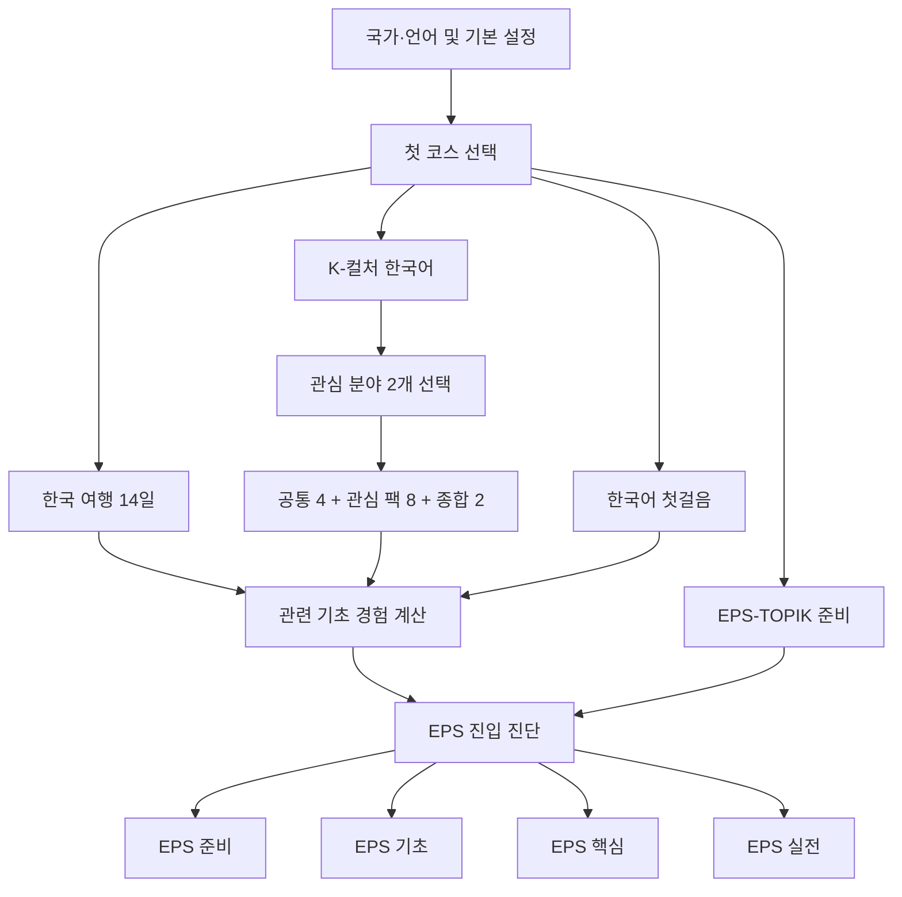

# K-Speak 독립 코스와 EPS 연계 학습 설계

- 작성일: 2026-08-08
- 상태: 사용자 검토용 설계안
- 대상 저장소: `korean-first-talk` / K-Speak
- 구현 범위: 한국 여행, K-컬처 한국어, EPS-TOPIK 준비
- 기존 과정: 한국어 첫걸음은 유지하며 이번 범위에서 콘텐츠를 확장하지 않는다.
- 후속 범위: 한국 생활·직장 실전은 이번 설계와 구현에서 제외한다.

## 1. 결정 요약

K-Speak는 하나의 긴 선형 코스를 목표별로 조금씩 바꾸는 구조에서, 사용자가 목적에 맞는 코스를 독립적으로 선택하는 구조로 확장한다.

최상위 코스는 다음 네 개다.

1. `foundation`: 기존 한국어 첫걸음
2. `travel`: 한국 여행 14일
3. `k-culture`: K-컬처 한국어 14일 시작 경로
4. `eps-topik`: EPS-TOPIK 준비 4단계, 30일 권장 경로

이번 신규 개발은 `travel`, `k-culture`, `eps-topik` 세 코스에만 적용한다. 기존 첫걸음 코드는 새 구조에 연결하고 기존 진도를 보존하는 데 필요한 최소 변경만 허용한다.

코스별 진도와 완료 결과는 독립적으로 저장한다. 로그인, 튜터, 저장 문장, 복습 엔진, 오디오 재생, 국가팩, 오프라인 지원은 공통 기반을 재사용한다.

여행과 K-컬처에서 익힌 숫자, 시간, 안내문, 지시 표현 같은 기초 능력은 EPS 준비에 활용한다. 그러나 다른 코스를 완료했다는 이유만으로 EPS 수업을 자동 통과시키지 않는다. EPS 진입 진단이나 EPS 전용 확인 문제를 통과했을 때만 시작 단계를 단축한다.

## 2. 제품 목표

### 2.1 사용자 목표

- 여행 예정자는 일반 한국어 과정을 먼저 끝내지 않고 바로 여행 회화를 시작한다.
- K-컬처 관심자는 좋아하는 분야를 통해 실제로 듣고 말할 수 있는 한국어를 배운다.
- EPS 준비자는 현재 수준에 맞는 단계에서 시작하고 시험형 읽기·듣기까지 이어간다.
- 한 코스에서 배운 기초 표현이 다른 코스에서 다시 도움이 된다는 연결감을 느낀다.
- 코스를 바꿔도 기존 진도, 저장 문장, 복습 기록이 사라지지 않는다.

### 2.2 제품 목표

- K-Speak의 핵심 약속인 상황 중심, 짧은 말하기, 기준 음성과 내 목소리 비교를 유지한다.
- 문화 콘텐츠를 단순 감상이나 단어 암기가 아니라 실제 대화 행동으로 전환한다.
- EPS를 별도 시험 모드로 제공하면서도 여행과 문화 학습이 EPS 기초 준비로 이어지게 한다.
- 국가별 번역과 설명은 동일한 한국어 학습 목표를 공유하되, 설명 방식과 발음 안내를 현지화한다.
- 저작권이 있는 가사, 드라마 대사, 웹툰 장면, 연예인 이미지 없이 자체 콘텐츠로 운영한다.

### 2.3 비목표

- EPS-TOPIK 합격을 보장하거나 합격 확률을 계산하지 않는다.
- 실제 시험의 비공개 문항을 복제하거나 유사 문항이라고 홍보하지 않는다.
- 무제한 AI 채팅, 실시간 교사 연결, 영상 스트리밍 수업을 추가하지 않는다.
- K-pop, K-drama, K-food, K-beauty, K-webtoon을 각각 최상위 모드로 분리하지 않는다.
- 한국 생활·직장 실전 과정을 이번 범위에 포함하지 않는다.
- 실제 인물의 목소리, 얼굴, 화법을 복제하지 않는다.

## 3. 설계 원칙

1. **사용자에게는 독립 코스, 내부에는 공통 기반**
   코스 선택과 진도는 분리하되 학습 엔진, 복습, 저장, 오디오는 공유한다.

2. **상황 먼저, 설명은 나중**
   모든 일반 수업은 장면 진입, 전체 대화, 핵심 표현, 바꿔 말하기, 녹음 비교, 한 턴 역할극 순서를 유지한다.

3. **완료와 능력을 구분**
   코스 완료는 학습 경로를 끝냈다는 뜻이다. EPS 준비도나 실제 능력은 진단과 객관식 확인 결과로 따로 표시한다.

4. **노출과 검증을 구분**
   여행이나 K-컬처에서 관련 표현을 배운 것은 `관련 경험`이다. EPS 진단을 통과한 상태만 `확인됨`으로 처리한다.

5. **억지 연동 금지**
   K-pop 수업에 산업 안전 표현을 삽입하는 식으로 주제를 훼손하지 않는다. 자연스럽게 공유되는 기초 능력만 연결한다.

6. **기존 진도 보존**
   기존 `day-*` 수업 ID를 변경하지 않는다. 새 코스만 이름공간이 있는 ID를 사용한다.

7. **저용량 우선**
   정적 이미지와 검수된 정적 음원을 우선하며, 영상 자동 재생을 전제로 하지 않는다.

## 4. 전체 사용자 흐름



### 4.1 신규 사용자

1. 국가팩과 한국어 경험을 선택한다.
2. 첫 코스를 `첫걸음`, `여행`, `K-컬처`, `EPS-TOPIK` 중에서 선택한다.
3. 여행은 바로 Day 1로 진입한다.
4. K-컬처는 관심 분야 두 개를 선택한 뒤 14일 경로를 생성한다.
5. EPS는 학습 경험 선택 후 준비 단계 또는 진입 진단으로 이동한다.

### 4.2 기존 사용자

- 현재 기존 첫걸음 진도와 홈을 그대로 유지한다.
- 기존 `learningGoal`에 따라 여행 또는 K-컬처 코스를 추천할 수 있지만 자동으로 활성 코스를 바꾸지 않는다.
- 코스 선택 화면에서 새 코스를 시작할 수 있다.
- 기존 `day-*` 진도, 복습, 저장 문장은 모두 `foundation` 소속으로 해석한다.

### 4.3 코스 전환

- 홈 상단의 현재 코스 버튼을 누르면 코스 선택 시트가 열린다.
- 각 코스에는 `시작 전`, `진행 중`, `완료` 상태와 다음 학습 위치가 표시된다.
- 코스를 바꿔도 진행 중 수업과 복습 일정은 유지된다.
- 하단 내비게이션 항목은 늘리지 않는다.

## 5. 코스 구조

## 5.1 한국 여행 14일

### 약속

한국 방문 중 자주 마주치는 장면에서 첫 문장을 말하고, 상대의 짧은 응답을 이해하고, 문제가 생겼을 때 도움을 요청할 수 있게 한다.

### 선행 조건

- 없음
- 한글을 읽지 못하는 사용자는 로마자와 느린 음성을 켤 수 있다.
- 한글 미니 드릴은 필요할 때 열 수 있지만 여행 진입을 막지 않는다.

### 14일 구성

| Day | 장면 | 핵심 행동 | EPS와 자연스럽게 겹치는 기초 |
|---|---|---|---|
| 1 | 공항 도착 | 인사하고 한국어가 서툴다고 알리기 | 기본 인사, 정중한 종결 |
| 2 | 입국·수하물 | 장소와 줄을 확인하기 | 표지, 위치, 질문 |
| 3 | 교통카드·SIM | 필요한 물건과 수량 요청하기 | 숫자, 단위, 구매 |
| 4 | 지하철·버스 | 노선, 출구, 목적지 확인하기 | 방향, 번호, 교통 정보 |
| 5 | 길 찾기 | 위치를 묻고 짧은 안내 확인하기 | 위치어, 이동 지시 |
| 6 | 숙소 체크인 | 예약과 이름 확인하기 | 이름, 날짜, 실용 정보 |
| 7 | 객실 문제 | 고장이나 부족한 물건 알리기 | 문제 보고, 요청 표현 |
| 8 | 식당 주문 | 메뉴와 수량 주문하기 | 수량, 음식 어휘, 요청 |
| 9 | 알레르기·맵기 | 먹지 못하는 재료와 강도 말하기 | 금지, 주의, 조건 |
| 10 | 카페·포장 | 매장 이용과 포장 요청하기 | 선택, 주문, 후속 질문 |
| 11 | 쇼핑 | 크기, 색상, 가격 묻기 | 비교, 상품 정보, 숫자 |
| 12 | 결제·환불 | 결제 방법과 영수증 확인하기 | 가격, 실용 자료, 확인 |
| 13 | 분실·병원·긴급 도움 | 문제를 설명하고 도움 요청하기 | 긴급 표현, 상태 설명 |
| 14 | 종합 여행 미션 | 이동부터 문제 해결까지 연속 역할극 | 안내문, 듣기, 상황 판단 |

### 완료 조건

- 14개 수업 완료
- Day 14 종합 역할극 시도
- 녹음이나 음성 인식 성공 여부는 완료 조건이 아니다.

## 5.2 K-컬처 한국어 14일 시작 경로

### 약속

좋아하는 한국 문화 장면에서 자주 듣고 읽는 표현을 이해하고, 그 표현을 실제 일상 대화의 자연스러운 존댓말로 바꿔 말할 수 있게 한다.

### 구성 방식

K-컬처는 하나의 최상위 코스 안에 다섯 관심 팩을 둔다.

- `k-pop`
- `k-drama`
- `k-food` - 음식과 디저트 포함
- `k-beauty`
- `k-webtoon`

사용자는 시작할 때 관심 팩 두 개를 선택한다. 시작 경로는 다음 14개 슬롯으로 구성한다.

- 공통 수업 4개
- 선택 팩 A 수업 4개
- 선택 팩 B 수업 4개
- 종합 수업 2개

### 경로 순서

| 슬롯 | 수업 |
|---|---|
| 1 | 공통: 존댓말과 반말의 거리감 |
| 2 | 관심 팩 A-1 |
| 3 | 관심 팩 B-1 |
| 4 | 공통: 짧은 반응과 감정 표현 |
| 5 | 관심 팩 A-2 |
| 6 | 관심 팩 B-2 |
| 7 | 공통: 숫자, 시간, 일정, 공지 |
| 8 | 관심 팩 A-3 |
| 9 | 관심 팩 B-3 |
| 10 | 공통: 콘텐츠 표현을 실제 말투로 바꾸기 |
| 11 | 관심 팩 A-4 |
| 12 | 관심 팩 B-4 |
| 13 | 종합: 같은 표현, 다른 상황 |
| 14 | 종합: 선택 분야 혼합 역할극 |

### 관심 팩별 수업

| 팩 | 1 | 2 | 3 | 4 |
|---|---|---|---|---|
| K-pop | 일정·티켓 | 공연장 공지 | 팬끼리 대화 | 라이브·댓글 표현을 실제 말로 바꾸기 |
| K-drama | 첫 만남과 관계 | 부탁·거절 | 사과·위로 | 극적인 대사를 자연스러운 일상 표현으로 바꾸기 |
| K-food | 메뉴·주문 | 재료·수량 | 조리 순서 | 알레르기·위생·주의사항 |
| K-beauty | 제품·색상 | 피부 고민·요청 | 사용 순서·라벨 | 주의사항·교환 |
| K-webtoon | 장면 순서 | 감정·말투 | 문맥과 다음 대사 | 과장된 대사를 실제 존댓말로 바꾸기 |

### 관심 분야 변경 규칙

- 첫 관심 팩 수업을 시작하기 전에는 자유롭게 변경한다.
- 시작 후 변경하면 이미 완료한 수업은 보존하고, 시작하지 않은 미래 슬롯만 새 관심 팩 수업으로 다시 계산한다.
- 생성된 `routeLessonIds`를 등록 정보에 저장해 여러 기기에서 같은 경로를 재현한다.
- 14일 시작 경로를 완료한 뒤 나머지 관심 팩을 추가로 학습할 수 있다. 추가 팩은 전체 코스 완료 상태를 되돌리지 않는다.

### 저작권 원칙

- 실제 노래 가사, 드라마 대사, 웹툰 컷, 연예인 이름·얼굴·목소리를 사용하지 않는다.
- 자체 캐릭터, 자체 대사, 자체 이미지와 정식 사용이 승인된 에셋만 사용한다.
- 브랜드 제품명 대신 일반 품목명을 사용한다.
- 향후 정식 제휴 콘텐츠는 별도의 라이선스 플래그와 콘텐츠 소스로 격리한다.

## 5.3 EPS-TOPIK 준비 4단계, 30일 권장 경로

### 약속

EPS-TOPIK의 읽기·듣기 형식에 익숙해지고, 일상 한국어, 실용 정보, 산업 안전과 작업 관련 한국어를 단계적으로 준비한다.

### 표시 원칙

- `합격 가능성 82%` 같은 표현을 사용하지 않는다.
- 단계 완료와 시험 준비 상태를 분리한다.
- 준비 상태는 `확인 전`, `기초 형성 중`, `실전 연습 가능` 같은 영역별 상태로 표시한다.
- 공식 기관이 제공하거나 인증한 앱처럼 보이게 하지 않는다.

### 진입 선택

1. `한국어를 처음 배워요` - EPS 준비 Day 1부터 시작
2. `다른 K-Speak 과정을 배웠어요` - 12~16문항 진입 진단
3. `이미 EPS-TOPIK을 공부했어요` - 확장 진단 또는 실전 점검부터 시작

진단 결과는 권장 시작점을 제시한다. 사용자는 더 쉬운 단계나 더 어려운 단계를 직접 선택할 수 있다.

### 단계 구성

| 단계 | 권장 Day | 핵심 영역 | 다른 코스 연동 |
|---|---|---|---|
| EPS 준비 | 1~6 | 소리·표기, 받침·연음 기초, 숫자·단위, 시간·날짜, 기본 문장 | 첫걸음에서 가장 많이 연결 |
| EPS 기초 | 7~14 | 일상 어휘·어법, 장소·이동, 구매, 일정·양식, 실용 자료 | 첫걸음·여행 일부 연결 |
| EPS 핵심 | 15~26 | 작업 지시, 산업 안전, 표지, 공정 순서, 문제 보고, 그림·대화·지문 이해 | EPS 전용 검증 필수 |
| EPS 실전 | 27~30 | 제한 시간 읽기, 제한 시간 듣기, 혼합 약점 훈련, 40문항 모의시험 | 다른 코스로 대체 불가 |

### 30일 세부 범위

- Day 1~2: 한글 소리와 표기, 받침·연음 듣기
- Day 3~4: 한자어·고유어 숫자, 단위, 가격, 수량
- Day 5~6: 시간·날짜·요일, 기본 인사와 정중한 문장
- Day 7~8: 장소·이동·생활 동사
- Day 9~10: 구매·수량·비교·금지
- Day 11~12: 일정표·신청서·영수증·간단한 표
- Day 13~14: 기초 어휘·어법과 단계 확인
- Day 15~16: 안전 표지와 보호 장비
- Day 17~18: 작업 지시와 기계 사용 순서
- Day 19~20: 공정 순서, 수량, 위치, 상태
- Day 21~22: 문제 보고, 고장, 건강, 긴급 상황
- Day 23~24: 그림 설명과 알맞은 문장 선택
- Day 25~26: 대화의 다음 반응, 이야기의 중심·세부 내용
- Day 27: 읽기 실전 세트
- Day 28: 듣기 실전 세트
- Day 29: 영역별 취약 항목 재연습
- Day 30: 읽기 20문항 + 듣기 20문항의 50분 모의시험

### 모의시험 규칙

- 문항과 음원은 자체 제작하고 공식 공개문제는 형식 연구에만 사용한다.
- 연습 세트는 중단 후 이어서 할 수 있다.
- 50분 모의시험은 벽시계 기준 타이머를 사용하며 앱을 벗어나도 시간이 계속 흐른다.
- 남은 시간 안에는 재진입할 수 있다. 시간이 끝나면 미응답은 미응답으로 처리한다.
- 정적 검수 음원이 없는 듣기 모의시험은 `준비 중`으로 표시하고 점수를 만들지 않는다.
- 브라우저 TTS는 일반 학습의 대체 재생에는 사용할 수 있지만 시험형 듣기 결과 산정에는 사용하지 않는다.

## 6. 자연스러운 EPS 연계 레이어

## 6.1 목적

여행과 K-컬처의 재미를 해치지 않으면서 EPS 준비에 필요한 기초 능력을 반복 노출한다. 전체 능력 그래프를 처음부터 구축하지 않고, EPS 기초에 직접 관련된 제한된 태그만 사용한다.

## 6.2 기초 능력 태그

| 영역 | 태그 예시 |
|---|---|
| 소리 | `sound-symbol`, `batchim`, `liaison` |
| 숫자 | `sino-number`, `native-number`, `time-date`, `price-quantity` |
| 기능 | `location-direction`, `request`, `prohibition`, `sequence`, `comparison`, `condition` |
| 문해 | `sign`, `schedule-table`, `label-instruction`, `dialogue-inference` |
| 듣기 | `number-listening`, `next-response`, `situation-match`, `gist-detail` |
| 말투·문화 | `polite-ending`, `relationship-register`, `basic-workplace-culture` |

각 일반 수업은 0~3개의 `bridgeSkillIds`를 가진다. 연관성이 약한 수업에는 태그를 억지로 붙이지 않는다.

## 6.3 `같은 표현, 다른 상황` 전이 문제

일부 여행·K-컬처 수업 마지막에 30초 내외의 전이 문제를 넣는다.

1. 현재 관심 장면에서 핵심 표현을 배운다.
2. 같은 문형이나 숫자를 다른 실제 상황에서 듣거나 읽는다.
3. 객관식 또는 한 턴 응답으로 의미를 확인한다.
4. 결과는 일반 수업의 단계 지표에 저장한다.

예시:

- 여행: `3번 출구로 가세요` -> `3번 출입구를 이용하세요`
- K-food: `재료를 넣고 잘 섞으세요` -> `부품을 넣고 버튼을 누르세요`
- K-beauty: `사용 전에 잘 흔드세요` -> 제품이나 도구의 사용 지시
- K-webtoon: 장면 순서 맞추기 -> 짧은 설명문의 사건 순서 파악
- K-drama: 다음 대사 고르기 -> 듣기 후속 반응 선택
- K-pop: 공연 시간표 읽기 -> 일정표에서 시간 정보 찾기

## 6.4 노출 계산과 검증

- `관련 경험`은 완료한 수업과 전이 문제 시도 기록에서 계산한다.
- 별도의 전역 `mastery` 점수를 저장하지 않는다.
- EPS 진단은 관련 경험이 있는 영역도 최소 한 문항 이상 확인한다.
- 진단을 통과한 항목만 `verifiedSkillIds`에 기록한다.
- 여행이나 K-컬처 완료만으로 EPS 준비 또는 핵심 단계를 완료 처리하지 않는다.
- EPS 진단 버전이 바뀌면 이전 결과는 기록으로 남기되 새 결과와 합산하지 않는다.

## 7. 정보 구조와 화면 명세

이번 범위에서 필요한 주요 화면은 여덟 개다.

## 7.1 첫 코스 선택

- 위치: 기존 온보딩의 학습 목표 단계 대체 또는 바로 다음 단계
- 표시: 첫걸음, 여행, K-컬처, EPS-TOPIK
- 각 항목: 이름, 한 줄 결과, 예상 기간, 오프라인 준비 상태
- 국가팩은 정렬과 추천 문구에만 영향을 주며 접근을 차단하지 않는다.
- EPS 수요가 높은 국가팩에서는 EPS를 상단에 추천할 수 있다.
- 정상, 번역 로딩, 데이터 없음, 설정 오류 상태를 제공한다.

## 7.2 코스 선택 시트

- 홈 상단의 현재 코스 버튼에서 연다.
- 네 코스의 상태와 다음 학습 위치를 표시한다.
- 모바일은 하단 시트, 데스크톱은 대화상자를 사용한다.
- 선택 즉시 홈 콘텐츠를 바꾸고 진도는 유지한다.
- 코스 데이터 로딩 실패 시 현재 코스를 유지한다.

## 7.3 활성 코스 홈

- 오늘의 수업과 코스 진도
- 필요한 복습 수
- 저장 문장 수
- 코스별 다음 목표
- 기존 오디오 준비 및 국가별 안내 패널 재사용
- 기존 Day 15~30 연장 패널은 새 코스 구조가 활성화되면 중복 표시하지 않는다.

## 7.4 K-컬처 관심 분야 선택

- 다섯 관심 팩 중 두 개를 체크박스로 선택한다.
- 각 팩은 아이콘, 이름, 학습 장면 예시를 표시한다.
- 정확히 두 개를 선택하기 전에는 시작 버튼을 비활성화한다.
- 이미 시작한 경로를 변경할 때는 완료 기록이 유지되고 미래 슬롯만 바뀐다는 설명을 보여준다.

## 7.5 수업 화면의 전이 단계

- 기존 수업 흐름 뒤, 저장과 요약 전에 배치한다.
- 일반 사용자에게는 `같은 표현, 다른 상황`으로 표시한다.
- EPS라는 이름은 과정마다 반복 노출하지 않는다.
- 실패해도 수업 완료를 막지 않고 복습 우선순위만 조정한다.

## 7.6 EPS 진입과 수준 진단

- 진입 경험 세 가지 중 하나를 선택한다.
- 진단은 진행 상황을 저장하고 중단 후 이어서 할 수 있다.
- 듣기 음원 오류 시 해당 문항을 실패로 채점하지 않고 재시도 상태로 둔다.
- 결과 화면은 단계 추천, 영역별 상태, 시작 버튼을 제공한다.

## 7.7 EPS 준비도와 모의시험

- 소리, 숫자, 어휘·어법, 실용 자료, 듣기, 안전 영역을 표시한다.
- 백분율 합격 예측은 표시하지 않는다.
- 영역별 최근 확인 일자와 권장 복습을 제공한다.
- 듣기 정적 음원이 준비되지 않으면 모의시험 시작을 막고 정확한 이유를 표시한다.

## 7.8 복습 화면

- 기본 필터: 현재 코스
- 추가 필터: 전체, 첫걸음, 여행, K-컬처, EPS
- 현재 코스에 복습이 없고 다른 코스에 복습이 있으면 빈 상태에서 바로 이동할 수 있다.
- EPS에서는 EPS 복습을 우선하고 다른 코스 문장은 `관련 기초 복습`으로 분리한다.

## 8. 데이터 모델

아래 타입은 구현 계약을 설명하기 위한 설계 형태다. 실제 구현에서는 현재 타입과 호환되도록 선택적 필드와 정규화 함수를 먼저 추가한다.

```ts
type CourseId = "foundation" | "travel" | "k-culture" | "eps-topik";

type CulturePackId =
  | "k-pop"
  | "k-drama"
  | "k-food"
  | "k-beauty"
  | "k-webtoon";

type CourseStatus = "not-started" | "in-progress" | "completed";
type EpsStageId = "prep" | "foundation" | "core" | "practice";

interface CourseEnrollment {
  courseId: CourseId;
  status: CourseStatus;
  contentVersion: string;
  routeVersion: string;
  routeLessonIds: string[];
  selectedCulturePackIds?: CulturePackId[];
  placementResult?: EpsPlacementResult;
  startedAt?: string;
  completedAt?: string;
  updatedAt: string;
}

interface EpsPlacementResult {
  assessmentVersion: string;
  recommendedStageId: EpsStageId;
  domainStates: Record<string, "not-checked" | "building" | "practice-ready">;
  verifiedSkillIds: string[];
  assessedAt: string;
}
```

### 8.1 `UserState` 확장

- `activeCourseId?: CourseId`
- `courseEnrollments?: Partial<Record<CourseId, CourseEnrollment>>`

기존 필드는 제거하지 않는다. 누락된 새 필드는 로드 시 기본값으로 정규화한다.

### 8.2 `Lesson` 확장

- `courseId?: CourseId`
- `moduleId?: string`
- `contentVersion?: string`
- `bridgeSkillIds?: string[]`
- `transferChallenge?: LessonTransferChallenge`

기존 수업은 `courseId`가 없으면 `foundation`으로 해석한다.

### 8.3 복습과 저장 문장

`ReviewItem`과 `SavedPhrase`에 선택적 `courseId`를 추가한다.

- 새 데이터는 항상 `courseId`를 기록한다.
- 기존 데이터는 `lessonId`를 통해 `foundation`으로 추론한다.
- 복습 ID와 저장 문장 ID에는 코스 이름공간을 포함해 충돌을 막는다.

### 8.4 수업 ID 규칙

- 기존 첫걸음: 현재 `day-*` ID 유지
- 여행: `travel-day-01`
- K-컬처 공통: `kculture-core-01`
- K-컬처 팩: `kculture-food-01`, `kculture-drama-01` 등
- K-컬처 종합: `kculture-capstone-01`
- EPS: `eps-prep-01`, `eps-foundation-01`, `eps-core-01`, `eps-practice-01`
- 진단: `eps-placement-v1`
- 모의시험: `eps-mock-v1`

모든 ID는 콘텐츠 버전이 바뀌어도 학습 목표가 동일하면 유지한다. 정답이나 문항 의미가 달라질 정도의 변경은 새 버전 ID를 사용한다.

## 9. 로컬 저장과 클라우드 동기화

## 9.1 로컬 마이그레이션

1. 기존 상태를 읽는다.
2. `activeCourseId`가 없으면 `foundation`을 설정한다.
3. 기존 `lessonProgress`는 그대로 유지한다.
4. 기존 복습·저장 문장에 런타임에서 `foundation`을 보충한다.
5. 기존 사용자의 첫걸음 등록 상태는 완료한 Day 수로 계산한다.
6. 기존 `learningGoal`은 추천용으로 유지하며 활성 코스를 자동 전환하지 않는다.

마이그레이션은 여러 번 실행해도 결과가 같은 멱등 함수여야 한다.

## 9.2 Supabase 변경안

### `profiles`

- `preferred_course_id text`
- 기존 `learning_goal` 유지

`preferred_course_id`는 사용자가 명시적으로 코스를 바꿀 때만 갱신한다. 단순 앱 재실행은 값을 바꾸지 않는다.

### 신규 `course_enrollments`

- `user_id uuid`
- `course_id text`
- `status text`
- `content_version text`
- `route_version text`
- `route_lesson_ids text[]`
- `selected_culture_pack_ids text[]`
- `placement_result jsonb`
- `started_at timestamptz`
- `completed_at timestamptz`
- `updated_at timestamptz`
- 기본키: `(user_id, course_id)`

### 기존 테이블

- `lesson_progress.course_id text not null default 'foundation'`
- `review_items.course_id text not null default 'foundation'`
- `saved_phrases.course_id text not null default 'foundation'`

기존 행은 `foundation`으로 백필한다. 기존 고유키는 유지한다.

## 9.3 병합 규칙

- 수업 진도는 현재의 단계 합집합 규칙을 유지하되 코스별 고유 lesson ID로 충돌을 막는다.
- 코스 완료 상태는 어느 한쪽이 완료면 완료를 보존한다.
- 양쪽 중 하나의 K-컬처 등록이 완료 상태면 완료된 경로와 선택 팩을 보존하고 더 이상 재계산하지 않는다.
- 양쪽 모두 진행 중일 때만 선택 팩과 미래 경로에 더 최신 `updatedAt`의 등록 정보를 사용한다.
- 오래된 기기의 선택 변경이 더 최신 경로를 덮어쓰지 않게 한다.
- 완료한 수업 진도는 경로 선택이 바뀌어도 삭제하지 않는다.
- EPS 진단 결과는 `assessedAt`이 더 최신인 한 세트를 사용한다. 서로 다른 버전의 점수를 합산하지 않는다.
- `preferred_course_id`는 명시적 전환 시각이 더 최신인 값을 사용한다.
- 동기화 실패 시 기존 재시도 대기 목록에 코스 등록 변경을 보존한다.
- 서버 저장에 성공한 변경만 대기 목록에서 제거한다.

## 10. 수업 엔진 적용

### 10.1 일반 수업

여행과 K-컬처는 기존 3~6분 마이크로 수업 리듬을 재사용한다.

1. 상황 진입
2. 전체 대화 듣기
3. 핵심 문장 자연 속도·느린 속도 듣기
4. 의미와 문장 뼈대
5. 바꿔 말하기
6. 기준 음성·내 녹음 비교
7. 한 턴 역할극
8. 같은 표현, 다른 상황
9. 저장과 복습 예고

전이 문제가 없는 수업은 8단계를 생략한다.

### 10.2 EPS 수업

EPS는 같은 엔진 안에서 다음 문제 유형을 추가한다.

- 그림 또는 상황에 맞는 문장 선택
- 표지·일정표·영수증·양식 정보 찾기
- 어휘·어법 선택
- 듣고 알맞은 그림 선택
- 듣고 다음 반응 선택
- 대화나 이야기의 중심·세부 정보 찾기
- 제한 시간 세트

녹음 비교는 발음 연습에 사용할 수 있지만 EPS 점수에는 포함하지 않는다.

## 11. 콘텐츠와 다국어 품질

### 11.1 지원 국가팩

현재 지원하는 모든 국가팩에서 화면과 핵심 설명을 제공한다.

- 영어권
- 일본
- 중국
- 베트남
- 스페인어권
- 인도네시아
- 캄보디아
- 미얀마
- 태국
- 말레이시아

### 11.2 번역 밀도

- 제목만 번역하고 설명은 영어로 남기는 상태를 허용하지 않는다.
- 수업 상황, 의미, 문장 구조, 발음 포인트, 역할극 안내, 전이 문제, 복습 이유까지 같은 밀도로 제공한다.
- 키 누락 시 키 이름을 화면에 표시하지 않는다.
- 긴 번역은 375px에서 버튼과 고정 UI를 밀어내지 않아야 한다.
- Khmer, Myanmar, Thai 등 비라틴 문자에 대해 UTF-8 원문과 렌더링을 실제 브라우저에서 확인한다.

### 11.3 콘텐츠 검수 순서

1. 한국어 교육 원문 작성
2. 자연스러운 한국어 표현과 수준 검수
3. 저작권·브랜드·실제 인물 참조 검사
4. 영어 기준 번역
5. 국가별 번역
6. 국가별 발음·문법 설명 검수
7. 정적 음원 연결
8. 화면과 복습 문맥 검수

## 12. 오디오와 시각 자산

### 12.1 일반 수업

- 모든 핵심 문장에 `normal`과 `slow` 음원을 연결한다.
- 정적 음원이 없으면 기존 브라우저 TTS 대체 재생 정책을 따른다.
- 대체 재생이 실패해도 일반 수업은 완료할 수 있다.
- 오프라인 팩은 코스별로 다운로드 상태와 예상 크기를 표시한다.

### 12.2 EPS 진단과 모의시험

- 객관적으로 채점하는 듣기 문항은 검수된 정적 음원만 사용한다.
- 음원이 없거나 손상되면 문항을 오답으로 처리하지 않는다.
- 모의시험은 필요한 음원이 모두 준비된 경우에만 시작한다.
- 음원 manifest에서 코스 ID, 문항 ID, 자연 속도, 라이선스 상태를 검증한다.

### 12.3 이미지

- 여행은 실제 상황을 이해할 수 있는 자체 제작 이미지 또는 라이선스가 명확한 사진을 사용한다.
- K-컬처는 자체 캐릭터와 자체 장면을 사용한다.
- K-webtoon은 자체 제작 패널만 사용한다.
- EPS 표지·작업 장면은 교육 목적에 맞는 자체 도식 또는 승인된 자산을 사용한다.
- 모든 필수 정보는 이미지에만 의존하지 않고 대체 텍스트나 문장으로 제공한다.

## 13. 오류·빈 상태·오프라인 처리

| 상황 | 처리 |
|---|---|
| 코스 정의 누락 | 현재 코스를 유지하고 다시 시도, 설정에서 다른 코스 선택 가능 |
| 경로 수업 누락 | 다음 유효 수업으로 자동 이동하지 않고 콘텐츠 오류 표시 |
| 번역 누락 | 검증 단계에서 빌드 실패, 런타임은 영어 또는 정의된 기본 문구로 안전하게 대체 |
| 일반 음원 실패 | 느린/일반 대체 재생 또는 텍스트 학습 계속 |
| EPS 듣기 음원 실패 | 해당 문항 미채점, 재시도 필요 |
| 진단 중 앱 종료 | 마지막 완료 문항부터 재개 |
| 모의시험 중 앱 종료 | 벽시계 타이머 유지, 남은 시간이 있으면 재개 |
| 오프라인 | 다운로드된 콘텐츠만 재생, 다운로드 성공을 거짓 표시하지 않음 |
| 동기화 실패 | 로컬 변경과 재시도 대기 목록 보존 |
| 선택 팩 충돌 | 최신 등록 경로 사용, 완료한 수업 진도는 모두 보존 |

## 14. 개인정보와 신뢰

- 음성 녹음과 브라우저 음성 인식은 사용자의 명시적 동작 이후에만 시작한다.
- 음성이 브라우저나 외부 인식 서비스로 전송될 수 있음을 시작 전에 알린다.
- 발음 결과는 참고용으로만 제공하고 EPS 점수와 결합하지 않는다.
- 분석 이벤트에는 음성 원본, 인식 전문, 자유 입력 내용, 시험 문항별 민감 정보를 전송하지 않는다.
- EPS 결과는 공식 성적이 아니며 학습용 결과임을 명확하게 표시한다.
- 공식 기관 로고, 명칭 조합, 색상과 화면을 모방해 제휴나 인증을 암시하지 않는다.

## 15. 분석 이벤트

필수 이벤트는 다음으로 제한한다.

- `course_catalog_viewed`
- `course_selected`
- `course_started`
- `course_switched`
- `culture_packs_selected`
- `lesson_started`
- `lesson_completed`
- `transfer_challenge_attempted`
- `eps_placement_started`
- `eps_placement_completed`
- `eps_stage_started`
- `eps_stage_completed`
- `eps_mock_started`
- `eps_mock_completed`
- `eps_mock_abandoned`

공통 속성:

- `courseId`
- `lessonId` 또는 `stageId`
- `countryPackId`
- `contentVersion`
- `success` 또는 완료 여부

측정 목적은 코스 선택, 초기 이탈, 완료, EPS 전환 흐름을 확인하는 것이다. 합격 가능성 예측이나 민감한 사용자 프로파일링에는 사용하지 않는다.

## 16. 모바일·접근성 기준

- 375px와 1280px에서 모든 핵심 화면을 확인한다.
- 코스 선택 시트와 EPS 진단의 하단 버튼은 내비게이션 및 안전 영역과 겹치지 않는다.
- 키보드가 열린 상태에서 다음 버튼과 현재 입력이 동시에 보이게 한다.
- 긴 번역은 줄바꿈하고 버튼 높이를 고정하지 않는다.
- 아이콘 버튼은 Lucide 아이콘과 접근 가능한 이름을 사용한다.
- 선택 상태는 색상만으로 구분하지 않는다.
- 타이머는 시각적 숫자와 스크린리더용 상태를 함께 제공하되 매초 과도하게 읽지 않는다.
- 웹툰형 패널과 작업 이미지는 의미 있는 대체 텍스트를 제공한다.
- 애니메이션은 필수가 아니며 `prefers-reduced-motion`을 존중한다.

## 17. 테스트 전략

## 17.1 단위 테스트

- 코스 레지스트리의 ID 유일성
- 코스별 수업 ID와 소속 일치
- K-컬처 14슬롯 경로 생성과 관심 팩 변경
- 기존 상태의 `foundation` 마이그레이션 멱등성
- 완료 수업에서 EPS 관련 경험 계산
- 관련 경험이 EPS 검증 완료로 자동 승격되지 않는지 확인
- EPS 진단 단계 추천
- 진단 버전 간 결과 비합산
- 코스별 복습 필터
- 코스 등록과 진도 병합 규칙

## 17.2 콘텐츠 계약 테스트

- 모든 필수 국가팩 번역 존재
- 번역 키가 원문 키 이름으로 노출되지 않음
- 모든 핵심 문장의 normal/slow 오디오 대상 존재
- EPS 채점 듣기 문항은 승인된 정적 음원만 참조
- 수업·문항·선택지 ID 중복 없음
- K-컬처 금지된 실제 IP 이름과 임시 문구 검사
- 여행 14일, K-컬처 시작 경로 14슬롯, EPS 30일 범위 검증

## 17.3 통합 테스트

- 신규 온보딩에서 세 신규 코스 각각 시작
- 코스 전환 후 각 진도 유지
- K-컬처 팩 변경 후 완료 진도 보존
- 여행·K-컬처 완료 후 EPS 진입 진단 연결
- 진단 중단과 재개
- 모의시험 타이머와 재진입
- 저장 문장과 복습에 올바른 courseId 기록
- 로그인·로그아웃·게스트 병합·다른 기기 동기화
- 오프라인 변경 후 재접속 동기화

## 17.4 브라우저 QA

- 375px 모바일, 1280px 데스크톱
- 현재 지원 국가팩 전체의 핵심 화면
- 긴 베트남어·스페인어와 비라틴 문자 렌더링
- 모바일 키보드, 안전 영역, 하단 고정 버튼
- 정적 음원 성공, TTS 대체, 완전 실패
- 콘솔 오류, 잘못된 라우팅, 화면 가림
- EPS 듣기 음원 없음 상태에서 거짓 채점 방지

## 18. 구현 단계와 모델 분담

설계 검토와 구현은 분리한다.

### 설계 검토 단계

상위 추론 모델에 다음을 요청한다.

- 과정 구분과 사용자 흐름의 모순 검토
- EPS 교육 범위와 시험형 평가의 과장 여부 검토
- K-컬처 14슬롯 경로와 팩 변경 규칙 검토
- 기존 데이터 마이그레이션과 동기화 충돌 검토
- 다국어·저작권·개인정보 위험 검토

### 구현 단계 A - 기반

권장 모델: Codex 5.5 수준

- 코스 타입과 레지스트리
- 상태 정규화와 마이그레이션
- 코스 등록 저장과 병합
- Supabase SQL 초안과 동기화 계약
- 코스 전환과 복습 필터 기반

### 구현 단계 B - 여행

권장 모델: Codex 5.4 또는 5.5 수준

- 여행 14일 데이터
- 홈과 수업 흐름 연결
- 번역 계약과 콘텐츠 테스트
- 모바일·오프라인 검증

### 구현 단계 C - K-컬처

권장 모델: Codex 5.5 수준

- 관심 팩 선택과 14슬롯 경로 생성
- 다섯 관심 팩 콘텐츠
- 전이 문제와 저작권 검수
- 팩 변경·동기화 테스트

### 구현 단계 D - EPS

권장 모델: Codex 5.5 수준

- 4단계 경로와 진입 진단
- EPS 관련 경험 계산
- 읽기·듣기 문제 유형
- 준비도 화면과 모의시험 타이머
- 정적 음원 검증과 거짓 채점 방지

### 구현 단계 E - 전체 QA

권장 모델: Codex 5.4 또는 5.5 수준

- 전체 테스트, lint, 타입 검사, 빌드
- 인증·진도 병합 회귀 테스트
- 10개 국가팩 핵심 화면
- 375px·1280px 브라우저 QA
- 오프라인·오디오 실패·동기화 재시도

모델 이름은 작업을 수행하는 앱이나 실행 환경에서 실제 선택해야 한다. 설계 문서는 특정 모델의 비공개 동작을 전제로 하지 않는다.

## 19. 구현 순서

1. 설계 승인과 콘텐츠 범위 동결
2. 코스 레지스트리와 ID 규칙
3. 기존 상태 마이그레이션과 동기화 테스트
4. 코스 선택·전환 UI
5. 여행 14일
6. K-컬처 공통·관심 팩·종합 경로
7. EPS 진입 진단과 4단계 경로
8. EPS 문제 유형과 모의시험
9. 다국어·오디오·오프라인 보강
10. 전체 브라우저 QA와 배포 전 검수

한 단계의 테스트와 회귀 검증이 끝나기 전에는 다음 단계로 넘어가지 않는다.

## 20. 완료 조건

- 세 신규 코스가 독립적으로 시작·진행·완료된다.
- 코스를 전환해도 다른 코스의 진도가 손실되지 않는다.
- 기존 사용자 Day 진도와 저장·복습 기록이 보존된다.
- K-컬처에서 두 관심 팩으로 14슬롯 시작 경로가 생성된다.
- 여행과 K-컬처의 관련 경험이 EPS 진입 진단에 참고된다.
- 다른 코스 완료만으로 EPS 단계가 자동 완료되지 않는다.
- EPS 진단과 모의시험은 정적 듣기 음원 오류를 오답으로 처리하지 않는다.
- 전체 국가팩에서 핵심 화면과 설명이 같은 밀도로 제공된다.
- 저작권 있는 실제 K-콘텐츠를 포함하지 않는다.
- 모바일 375px와 데스크톱 1280px에서 핵심 흐름이 겹치거나 가려지지 않는다.
- 단위·통합·콘텐츠 계약 테스트, lint, TypeScript 검사, 프로덕션 빌드가 통과한다.

## 21. 주요 위험과 대응

| 위험 | 영향 | 대응 |
|---|---|---|
| 코스 수 증가로 앱이 복잡해짐 | 초보자 선택 피로 | 첫 코스 선택은 네 개만, 문화 분야는 내부 팩으로 제한 |
| EPS 연동이 문화 학습을 방해 | 재미와 브랜드 약화 | 자연스러운 기초 태그만 연결, 산업 표현 강제 금지 |
| 다른 과정 완료를 능력으로 오인 | 잘못된 단계 추천 | EPS 진단으로만 검증 |
| 번역량 급증 | 품질 불균형 | 한국어 원문 동결 후 동일 스키마로 번역, 계약 테스트 |
| 정적 듣기 음원 미완성 | 잘못된 EPS 점수 | 정적 음원 없으면 채점과 모의시험 비활성화 |
| 경로 선택의 기기 충돌 | K-컬처 경로 변경 | 최신 등록 사용, 완료 진도 영구 보존 |
| 기존 진도 손실 | 신뢰와 데이터 손상 | 기존 ID 유지, 멱등 마이그레이션, 병합 회귀 테스트 |
| 실제 K-콘텐츠 권리 침해 | 법적·배포 위험 | 자체 제작 원문·이미지·음원, 라이선스 메타데이터 |
| App.tsx 비대화 | 변경 위험 증가 | 코스 선택, 경로, EPS 평가를 경계가 명확한 모듈로 분리 |

## 22. 승인 후 남은 설계 작업

이 문서가 승인되면 코드 작성 전에 별도의 구현 계획에서 다음을 파일 단위 작업으로 나눈다.

- 코스 레지스트리와 상태 타입
- 로컬 마이그레이션과 클라우드 SQL
- 화면 컴포넌트 분리
- 여행 콘텐츠 스키마와 14일 원문
- K-컬처 공통·팩·종합 원문
- EPS 진단·단계·문항 스키마
- 국가별 번역 작업 묶음
- 오디오 manifest 확장
- 테스트와 QA 명령

## 22.1 자체 검토로 확정한 보충 결정

아래 결정은 앞선 설명에서 생길 수 있는 구현상 모호함을 제거한다.

### 상태의 단일 원본

- EPS 진단 결과는 `courseEnrollments["eps-topik"].placementResult`에만 저장한다.
- `UserState` 최상위에 별도의 EPS 진단 결과를 두지 않는다.
- `activeCourseId`와 `courseEnrollments`가 실제 수업 경로의 단일 원본이다.
- 기존 `learningGoal`은 호환과 추천에만 사용하며 수업 경로를 직접 바꾸지 않는다.

| 첫 코스 | 호환 learningGoal |
|---|---|
| 첫걸음 | daily |
| 여행 | travel |
| K-컬처 | k-content |
| EPS-TOPIK | work |

### K-컬처 경로와 제작량

- 완료된 14슬롯 경로는 고정하며 기기 병합이나 관심 변경으로 다시 계산하지 않는다.
- 진행 중 경로는 완료한 슬롯을 보존하고 시작하지 않은 슬롯만 새 관심 팩으로 바꾼다.
- 모든 관심 조합을 지원하려면 공통 4개, 관심 팩 20개, 종합 2개로 총 26개 원본 수업을 제작한다.

### EPS 문항 은행 최소 기준

- 진입 진단 16문항
- 준비·기초·핵심 단계 확인 각 12문항, 총 36문항
- 읽기 연습 20문항
- 듣기 연습 20문항
- 서로 겹치지 않는 40문항 모의시험 2세트, 총 80문항

최소 총량은 172문항이다. 이 기준에 미달하면 제품에서 완성된 시험 준비 과정으로 표현하지 않는다.

### 구현 모듈 경계

- 코스 레지스트리와 콘텐츠는 `src/data/courses/`에 둔다.
- 다음 수업과 완료 계산은 `courseEngine`이 담당한다.
- K-컬처 경로 생성은 `culturePathEngine`이 담당한다.
- EPS 관련 경험 계산은 `epsBridgeEngine`이 담당한다.
- 진단과 모의시험은 `epsAssessmentEngine`이 담당한다.
- 새 화면은 `src/components/courses/`로 분리하고 기존 `App.tsx`에는 조합과 라우팅만 남긴다.
- 신규 콘텐츠를 기존 대형 `lessons.ts`에 계속 누적하지 않는다.
## 23. 근거 자료

- `CODEX_HANDOFF.md`
- `docs/LEARNING_PROGRAM_DEVELOPMENT.md`
- `docs/COUNTRY_APP_PROGRAM_BORROWING_2026-08-02.md`
- `docs/supabase/schema.sql`
- `src/types.ts`
- `src/App.tsx`
- `src/services/storage.ts`
- `src/services/cloudSync.ts`
- EPS-TOPIK 공식 시험 안내: <https://epstopik.hrdkorea.or.kr/epstopik/abot/exam/selectTopikDesc.do?lang=ko>
- EPS-TOPIK 공식 출제 기준: <https://epstopik.hrdkorea.or.kr/epstopik/abot/exam/selectStandardDesc.do?lang=ko>
- EPS-TOPIK 공식 공개문제 안내: <https://epstopik.hrdkorea.or.kr/epstopik/book/pub/publicbookDesc.do?lang=en>
